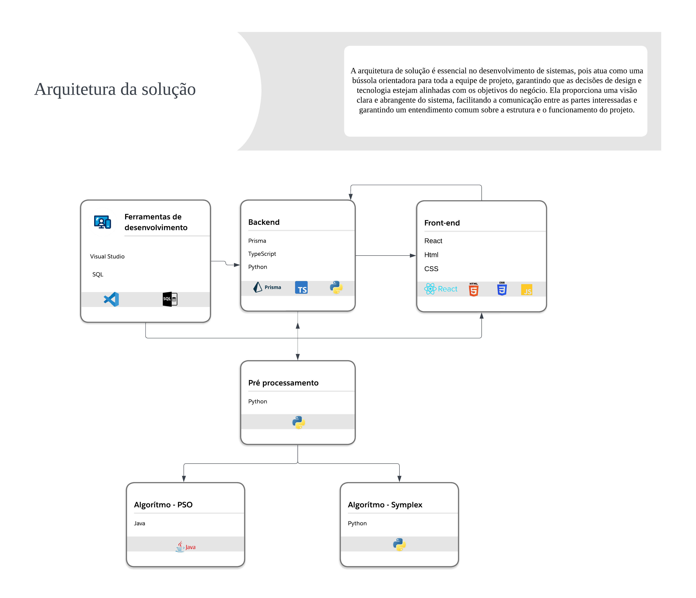

# Arquitetura da solução

A arquitetura de solução é fundamental no desenvolvimento de sistemas, atuando como uma diretriz crucial para a equipe de projeto. Ela assegura que as decisões de design e tecnologia estejam em sincronia com os objetivos de negócio. Esta abordagem proporciona uma compreensão clara e completa do sistema, melhorando a comunicação entre todas as partes interessadas e garantindo uma visão unificada sobre a estrutura e funcionalidade do projeto. Identificando proativamente riscos e vulnerabilidades, a arquitetura de solução desempenha um papel vital na otimização do processo de desenvolvimento, contribuindo para a redução de custos e economia de tempo. Além disso, a documentação precisa da estrutura e dos padrões do sistema é essencial para a manutenção e escalabilidade futura, garantindo que a solução continue a atender às necessidades do negócio de maneira eficiente e sustentável a longo prazo.

Na prática, o desenvolvimento da arquitetura da solução oferece múltiplos benefícios ao longo das fases do projeto, destacando-se principalmente pelos seguintes motivos:

**Visão clara**: Fornece uma representação visual e conceitual dos componentes do sistema e suas interações, facilitando a compreensão global da estrutura.

**Comunicação**: Uma arquitetura bem definida atua como uma linguagem comum entre os stakeholders e a equipe de desenvolvimento, promovendo alinhamento e entendimento compartilhado.

**Planejamento e design**: Auxilia na identificação precisa dos requisitos técnicos, levando a um desenvolvimento mais eficiente e a soluções tecnológicas adequadas.

**Gestão de riscos e problemas**: A visualização da arquitetura permite identificar antecipadamente potenciais falhas e desafios, permitindo abordagens proativas de mitigação.

**Manutenção e escalabilidade**: Uma arquitetura clara e bem documentada facilita a realização de alterações e expansões necessárias, contribuindo para a longevidade e adaptabilidade do sistema.

