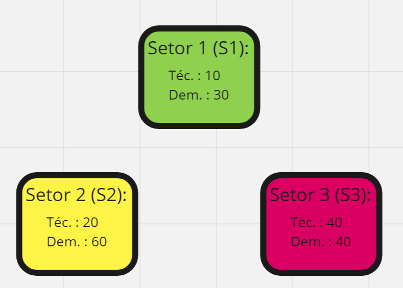

# Entendimento do contexto do problema: modelagem e representação

## Sumário
- [Modelagem Simplex](#modelagem-simplex)
- [Modelagem Local Search](#modelagem-local-search)
- [Modelagem PSO](#modelagem-pso)

## Descrição do Contexto do problema

A V.Tal - Rede Neutra de Telecomunicações - S.A. enfrenta desafios complexos em relação à gestão e distribuição de sua extensa força de campo, composta por mais de 6000 técnicos, sendo 1000 próprios e 5000 terceirizados, distribuídos em mais de 2300 cidades no Brasil. Esta força de campo é responsável pela instalação de conectividade, um aspecto crítico para a empresa, pois impacta diretamente nos custos e nos níveis de serviço (SLAs).

Para otimizar a distribuição desses técnicos e, consequentemente, maximizar a eficiência operacional e melhorar os indicadores de desempenho de atendimento, como o SLA, a V.Tal busca desenvolver um algoritmo de otimização. Esse algoritmo deve considerar variáveis-chave, como a quantidade de técnicos por área, as áreas atendidas, as demandas de instalação e reparo, os tempos de deslocamento entre os técnicos e os pedidos.

O algoritmo deve retornar a alocação ideal dos técnicos, distribuindo-os entre os setores já definidos pela empresa. O algoritmo deve considerar fatores como custo de deslocamento, e buscar maximizar a eficiência dos técnicos.

Com o desenvolvimento desse projeto, a V.Tal espera alcançar melhorias significativas em seus indicadores-chave de desempenho, incluindo otimização na utilização dos recursos, redução de custos operacionais e aprimoramento nos níveis de serviço, o que contribuirá para a excelência de suas operações em telecomunicações.

## Dados Disponíveis

A V.Tal - Rede Neutra de Telecomunicações - S.A. tem acesso a uma ampla gama de informações essenciais para a implementação eficaz do algoritmo de otimização de alocação e distribuição de equipes de técnicos. Os dados disponíveis abrangem:

Matrícula do Técnico: Identificação única para cada técnico responsável pela execução dos serviços.

ID de Venda: Identificador exclusivo atribuído a cada transação ou venda de serviços.

Logradouro: Nome da rua ou avenida associado ao local do serviço técnico.

Número: Número do prédio ou residência correspondente ao local do serviço técnico.

Bairro: Nome da região onde o serviço técnico está sendo realizado.

CEP (Código de Endereçamento Postal): Código postal que identifica a área específica de entrega.

Latitude do Pedido: Coordenada geográfica indicando a localização no eixo norte-sul.

Longitude do Pedido: Coordenada geográfica indicando a localização no eixo leste-oeste.

Localização Geográfica dos Setores (Polígonos): Representação espacial das áreas delimitadas e setorizadas em formato poligonal.

Ponto de Partida dos Técnicos: Coordenadas geográficas indicando o local de origem das atividades ou deslocamentos dos técnicos.

Esses dados fornecem insights valiosos para a análise geoespacial, a alocação eficiente de recursos e a otimização do planejamento logístico para a distribuição das equipes de técnicos em todo o território nacional. Eles contribuem significativamente para a melhoria do desempenho operacional e para garantir a conformidade com os padrões de serviço estabelecidos pela empresa.

## Objetivo da Solução 

Com base no contexto fornecido, o objetivo principal desta solução é implementar um algoritmo de otimização para a alocação e distribuição eficientes das equipes de técnicos da V.Tal - Rede Neutra de Telecomunicações - S.A. O objetivo é maximizar a eficiência operacional e aprimorar os indicadores de nível de serviço (SLAs), com foco em duas metas principais:

Otimização dos Recursos: Garantir a distribuição adequada e eficaz dos técnicos em diferentes regiões e setores, levando em consideração variáveis críticas, como a quantidade de técnicos por área, as demandas de instalação e reparo, e os indicadores de SLA. O objetivo é utilizar os recursos disponíveis de forma otimizada, reduzindo custos operacionais e maximizando a produtividade das equipes.

Melhoria dos Indicadores de Nível de Serviço: Buscar aprimorar os indicadores de desempenho associados à operação, como tempos de resposta, cumprimento de prazos e satisfação do cliente. A solução visa garantir que as equipes de técnicos possam atender de forma eficiente e oportuna as demandas de instalação e reparo, contribuindo para o cumprimento dos SLAs estabelecidos pela empresa.

Portanto, o objetivo final é desenvolver uma plataforma ou interface com um algoritmo de otimização da alocação de técnicos robusto nos bastidores, que permita aos coordenadores de operações tomar decisões fundamentadas e estratégicas na distribuição das equipes de técnicos, garantindo a máxima eficiência e a melhor prestação de serviços de telecomunicações em todo o território nacional.

## Restrições Gerais do Problema

Ao desenvolver o algoritmo de otimização para a distribuição das equipes de técnicos na V.Tal - Rede Neutra de Telecomunicações - S.A., é crucial considerar duas restrições essenciais para garantir a eficiência e a viabilidade da solução proposta:

Restrição de Atribuição de Setores: Cada técnico deve ser alocado exclusivamente em um único setor durante a execução das tarefas. Essa restrição visa garantir a clareza e a responsabilidade inequívoca de cada técnico em relação a um determinado setor, facilitando a supervisão, o acompanhamento do desempenho e a otimização da gestão de recursos humanos.

Restrição de Conservação de Recursos Humanos: O número total de técnicos após a alocação deve permanecer igual ao número inicial de técnicos disponíveis. Essa restrição assegura que não haja duplicação ou perda de recursos humanos durante o processo de distribuição, mantendo a integridade do pool de técnicos e garantindo que todas as demandas de serviços sejam atendidas de forma eficaz e eficiente, sem interrupções ou lacunas na prestação de serviços técnicos.

Ao considerar e implementar essas restrições de maneira adequada, o algoritmo de otimização pode funcionar de forma mais precisa e confiável, garantindo uma distribuição equitativa e eficiente dos técnicos, bem como a realização eficaz de todas as tarefas de instalação e reparo em todo o território nacional.

## Modelagem Simplex

Esta modelagem busca minimizar o número de técnicos transferidos entre setores enquanto respeita as restrições impostas, restrições essas que incluem limitações dadas pela demanda de cada setor e o número de técnicos já alocados nos mesmos.

Supondo que para um determinado setor (A) no conjunto de setores atendidos (S), o número de técnicos do setor é $x_A$ e o número de técnicos tranferidos do setor B é $m_{B,A}$. Além disso, o número de chamadas do setor (demanda) é dada por $o_A$, o tempo de reslução médio de serviço deste setor é $t_{s}$ e o tempo de jornada de trabalho é $t_{t}$, assim, temos a modelagem:

*Variáveis de decisão:*

$m_{j,i}$ = número de técnicos que foram transferidos do setor j para o setor i

$m_{i,j} \in N \ \And  \ i,j \in S$

*Objetivo:*
$$Min \ \ T = \sum^n_{i=0}\sum^n_{j=0} m_{j,i} \ , \ \forall i \not = j\$$

*Restrições:*

$\forall i \in S , \ \sum^n_{j=0}  m_{j,i}\geq o_i\times\frac{t_{s}}{t_{t}} - x_i \ | \ i \not = j$  

$m_{j,i} \leq x_j \ \forall i, j \in S$  

*Gargalos da modelagem:*

Esta modelagem busca minimizar o número de transferências entre os setores, atendendo a demanda de cada setor, contudo, ela possui alguns gargalos em casos extremos que podem causar problemas, como: 
- A modelagem não diferencia se um determinado setor i recebeu técnicos de um setor j ($m_{j,i} \geq 0$), havendo a possibilidade da resposta incluir retorno de técnicos do setor i para o setor j ($m_{i,j} \geq 0$);
- O número de técnicos a serem trasnferidos pode ser um número não inteiro;
- Alterações na produtividade dos técnicos ($\frac{t_{s}}{t_{t}}$) podem mudar radicalmente o número de técnicos transferidos ou até mesmo inviabilizar a modelagem (a modelagem retorna que não existe solução);
- O modelo não apresenta custos relacionados a distância de setores ou entre serviço e técnico nem informações sobre as posições dos técnicos, podendo gerar respostas inconvenientes para a operação real;

*Influência de variações dos dados:*

Para fazermos os testes, há uma facilitação da compreensão ao começarmos com um exemplo:

Suponha 3 setores ($S_1 , \ S_2 , \ S_3$), os quais possuem as demandas de 30 serviços, 60 serviços e 40 serviçoes respectivamente, possuindo também, em ordem, 10 técnicos, 20 técnicos e 40 técnicos. Finalmente, iremos assumir que a razão de serviços feitos por tempo de trabalho ($\frac{t_{s}}{t_{t}}$) é de 0.5.

### Exemplo descrito:

No desenho acima, é fácil identificar que uma solução fácil seria transferir 5 técnicos do setor 3 para o 1 e 10 técnicos do setor 3 para o setor 2, agora necessitamos confirmar com o modelo. Para tal, o modelo será:

$$Min Z = m_{1,2} + m_{1,3} + m_{2,1} + m_{2,3} + m_{3,1} + m_{3,2}$$

Sujeito a:

$$m_{2,1} + m_{3,1} -m_{1,2} -m_{1,3} \geq 5 \quad (o_1\times\frac{t_{s}}{t_{t}} - x_1 = 30\times0.5 - 10)$$
$$m_{1,2} + m_{3,2} -m_{2,1} -m_{2,3} \geq 10$$
$$m_{1,3} + m_{2,3} -m_{3,1} -m_{3,2} \geq -20$$
$$m_{1,2} + m_{1,3} \leq 10$$
$$m_{2,1} + m_{2,3} \leq 20$$
$$m_{3,1} + m_{3,2} \leq 40$$

Resolvendo este modelo utilizando o simplex, retornará que $m_{3,1} = 5$ e $m_{3,2} = 10$, assim como na solução intuitiva encontrada anteriormente. Com o nosso modelo base feito, iremos analisar como o modelo comporta-se com pequenas variações.

### Caso 1:
Neste caso, iremos variar a o número de serviços do setor $S_1$ de 30 ordens de serviço para 40 ordens de serviço, com isso, o novo modelo fica:

$$Min Z = m_{1,2} + m_{1,3} + m_{2,1} + m_{2,3} + m_{3,1} + m_{3,2}$$

Sujeito a:

$$m_{2,1} + m_{3,1} -m_{1,2} -m_{1,3} \geq 10$$
$$m_{1,2} + m_{3,2} -m_{2,1} -m_{2,3} \geq 10$$
$$m_{1,3} + m_{2,3} -m_{3,1} -m_{3,2} \geq -20$$
$$m_{1,2} + m_{1,3} \leq 10$$
$$m_{2,1} + m_{2,3} \leq 20$$
$$m_{3,1} + m_{3,2} \leq 40$$

Ao resolvermos este modelo utilizando-se do simplex, o resultado apresentado é $m_{3,1} = 10$ e $m_{3,2} = 10$, ou seja, o aumento do número de serviços no setor $S_1$ acarretou em um aumento proporcional no número de técnicos transferidos do setor $S_3$ (possui uma folga de técnicos para a demanda do setor, por isso a restrição 3 tem valor negativo) para o $S_1$.

### Caso 2:
Neste novo caso, iremos variar o custo do deslocamento de técnicos, contudo, o modelo não possui nenhuma variável que relaciona-se diretamente a este custo, assim, como justificado de extensamente na seção "_Diferença ao variar o custo de deslocamento_", iremos assumir que o tempo médio por serviço ($t_s$) tem uma relação inversamente proporcional, com isso, ao variarmos o custo do deslocamento, variamos a proporção $\frac{t_s}{t_t}$. Neste caso, utilizaremos o exemplo original, contudo, o valor de $\frac{t_s}{t_t}$ será de 0.4 (uma redução de 20% do tempo de serviço, ou seja, um aumento do custo de transporte), resultando em:

$$Min Z = m_{1,2} + m_{1,3} + m_{2,1} + m_{2,3} + m_{3,1} + m_{3,2}$$

Sujeito a:

$$m_{2,1} + m_{3,1} -m_{1,2} -m_{1,3} \geq 2$$
$$m_{1,2} + m_{3,2} -m_{2,1} -m_{2,3} \geq 4$$
$$m_{1,3} + m_{2,3} -m_{3,1} -m_{3,2} \geq -24$$
$$m_{1,2} + m_{1,3} \leq 10$$
$$m_{2,1} + m_{2,3} \leq 20$$
$$m_{3,1} + m_{3,2} \leq 40$$

Ao utilizarmos o método simplex para resolver o sistema linear, ele nos retorna que $m_{3,1}=2$ e $m_{3,2}=4$. Portanto, segundo o modelo, ao aumentarmos o custo de transporte, o número de técnicos trasnferidos entre setores diminui.

*Diferença ao variar o custo de deslocamento:*

Como a modelagem depende apenas do número de técnicos do setor, a demanda do setor e a eficiência dos técnicos, ao criarmos uma variação no custo de deslocamento, o modelo não seria diretamente afetado, porém, o tempo médio por serviço seria alterado. Ao dividirmos o tempo de serviço em tempo de transporte até o serviço ($t_{s,t}$) e tempo no serviço ($t_{s,s}$) e assumirmos que o técnico passa em média uma porcentagem u do serviço em deslocamento ($t_{s,t} = u \times t_{s} \ , \ t_{s,s} = (1-u)t_{s}$), quando aumentarmos o custo por deslocamento, a média de tempo de deslocamento diminui, diminuindo o tempo por serviço e causando uma diminuição do valor de $o_i \times \frac{t_s}{t_t} - x_i$ das retrições do primeiro tipo, assim, diminuindo a necessidade de transferência de técnicos, contudo, necessitando mais setores para atender a demanda da área.
Agora, ao diminuirmos o custo de deslocamento, o tempo médio de deslocamento aumentará, causando um aumento no tempo de serviço, o que aumenta o valor de $o_i \times \frac{t_s}{t_t} - x_i$ das retrições do primeiro tipo, causando portanto um aumento no número de transferências.

## Modelagem Local Search

Esta modelagem matemática foi desenvolvida para visando tornar a distribuição de técnicos e serviços entre os setores proporcional, considerando a distância entre os setores e as quantidades iniciais de técnicos e serviços.

A fórmula de custo objetivo combina dois objetivos principais. O primeiro é minimizar a diferença entre a razão de técnicos em um determinado setor por total de técnicos na cidade e a razão de serviços em um determinado setor por total de serviços na cidade. O segundo é minimizar a distância total percorrida pelos técnicos durante as transferências entre os setores.

As restrições garantem que o número de técnicos transferidos entre os setores seja sempre não negativo, refletindo a realidade operacional.

Essa abordagem busca equilibrar efetivamente a distribuição de recursos, minimizando custos e maximizando a eficiência operacional em vários setores, levando em consideração não apenas os aspectos quantitativos, mas também a logística envolvida.

Sendo  
$d_{ij}$ a distância do setor $i$ ao setor $j$.  
$t_{i}$ a quantidade de técnicos inicialmente presentes no setor $i$.  
$s_{i}$ a quantidade de serviços inicialmente presentes no setor $i$.  
$T$ a quantidade total de técnicos. 
$S$ a quantidade total de serviços. 
$n$ a quantidade total de setores.

*Variáveis de decisão:*

$x_{i,j}$ = número de técnicos que foram transferidos do setor i para o setor j.  
$y_{i}$ = número de técnicos que chegaram ou, caso negativo, saíram do setor i.  

*Objetivo:*  
$$Min  \ \ Z = \sum_{i=1}^{n} \left\lvert\frac{t_{i} + y_{i}}{T} - \frac{s_i}{S}\right\rvert \$$
$$e$$
$$Min \ \ D = \sum_{i=1}^{n} \sum_{j=1}^{n} d_{ij} \cdot x_{ij} \$$

*Restrições:*  
$x_{i,j} \geq 0$

## Modelagem PSO

A modelagem matemática em questão representa um notável avanço na eficiência operacional, buscando otimizar a alocação estratégica de técnicos em diversos setores. Ao considerar meticulosamente uma gama de variáveis cruciais, o modelo procura alcançar um equilíbrio delicado entre a redução dos custos de deslocamento e a maximização da capacidade de atendimento em cada setor, resultando em um equilíbrio operacional ideal.

O modelo é construído sobre a premissa de distribuição equitativa de trabalho entre os técnicos, aprimorando a eficácia da alocação de recursos e minimizando ineficiências operacionais. Além disso, prioriza a otimização dos deslocamentos, de forma a reduzir a distância percorrida pelos técnicos durante o atendimento das demandas, contribuindo assim para a redução de custos e o aumento da eficiência geral do sistema.

*Variáveis de decisão:*

Sendo $T$ o conjunto de todos os técnicos
Sendo $P$ o conjunto de todos os pedidos de trabalho 
Sendo $x_{ij}$ uma variável binária 0 ou 1 de modo que ela fala se o i-nésimo técnico vai para o j-ésimo setor  
Sendo $y_{ijk}$ uma variável binária 0 ou 1 de modo que ela fala se o i-nésimo técnico vai para o j-ésimo setor e vai atender o k-ésimo pedido  
Sendo $t_{ik}$ o tempo de deslocamento do i-nésimo técnico para o k-ésimo pedido  
Sendo $f$ o número de técnicos  
Sendo $n$ o número de setores  
Sendo $p_{j}$ o conjunto de pedidos dentro do j-ésimo setor  

*Objetivo:*  

$$ \min_{\forall t \in T, \forall p \in P} (w_{1} \cdot \sum_{i = 1}^{f} \sum_{j = 1}^{n} x_{ij} \cdot \frac{\sum_{k \in p_{j}}^{}y_{ijk}\cdot t_{ik}}{\sum_{k \in p_{j}}^{}y_{ijk}} + w_{2} \cdot \sum_{i=1}^{n} p_{i} -{\sum_{i=1}^{f} x_{ji}\sum_{k \in p_{i}}^{}y_{ijk}}) $$

*Restrições:*  

$$ \sum_{j = 1}^{n} x_{ij} = 1, \forall i = 0, 1,...,f-1,f $$

*Indicador para o planejador HG (Habilidade de Gestão)*

Este índice de habilidade de gestão avalia a eficiência dos técnicos no atendimento de pedidos, levando em consideração os tempos médios de deslocamento. A fórmula utilizada para calcular esse índice compara a capacidade de atendimento, com base nos tempos médios de deslocamento, à demanda total. Essa demanda total é calculada considerando que cada técnico trabalha 8 horas por dia, e o tempo de atendimento padrão é estabelecido em 2 horas por pedido. O índice é obtido pela razão entre a produtividade esperada dos técnicos na situação atual (ou seja, quantos pedidos os técnicos podem atender) e a quantidade total de pedidos. Se o resultado do índice for superior a 1, indica uma situação confortável, sugerindo que não há necessidade imediata de contratar mais técnicos. No entanto, se o índice for menor que 1, isso aponta para uma necessidade mais urgente de contratação de técnicos para lidar com a demanda.

$$
HG = \frac{8 \cdot f^2}{\sum_{i = 1}^{f} \sum_{j = 1}^{n} x_{ij} \cdot \frac{\sum_{k \in p_{j}} (t_{ik}+2)}{\sum_{k \in p_{j}}^{}x_{ij}} \cdot (\sum_{i=0}^{n} p_{i} - \sum_{j=0}^{f} p_{ij})}
$$

## Modelagem PSO linearizada para Simplex

*Variáveis de decisão:*

Sendo $T$ o conjunto de todos os técnicos
Sendo $P$ o conjunto de todos os pedidos de trabalho 
Sendo $x_{ij}$ uma variável binária 0 ou 1 de modo que ela fala se o i-nésimo técnico vai para o j-ésimo setor  
Sendo $t_{ik}$ o tempo de deslocamento do i-nésimo técnico para o k-ésimo pedido  
Sendo $f$ o número de técnicos  
Sendo $n$ o número de setores  
Sendo $p_{j}$ o conjunto de pedidos dentro do j-ésimo setor  

*Objetivo:*  

$$ \min_{\forall t \in T, \forall p \in P} (w_{1} \cdot \sum_{i = 1}^{f} \sum_{j = 1}^{n} x_{ij} \cdot \frac{\sum_{k \in p_{j}}^{}t_{ik}}{p_{j}})$$

*Restrições:*  

$$ \sum_{i = 0}^{n} x_{ji} = 1,  \forall  j = 1,2,...,f-1,f $$

*Indicador para o planejador HG (Habilidade de Gestão)*

Este índice de habilidade de gestão avalia a eficiência dos técnicos no atendimento de pedidos, levando em consideração os tempos médios de deslocamento. A fórmula utilizada para calcular esse índice compara a capacidade de atendimento, com base nos tempos médios de deslocamento, à demanda total. Essa demanda total é calculada considerando que cada técnico trabalha 8 horas por dia, e o tempo de atendimento padrão é estabelecido em 2 horas por pedido. O índice é obtido pela razão entre a produtividade esperada dos técnicos na situação atual (ou seja, quantos pedidos os técnicos podem atender) e a quantidade total de pedidos. Se o resultado do índice for superior a 1, indica uma situação confortável, sugerindo que não há necessidade imediata de contratar mais técnicos. No entanto, se o índice for menor que 1, isso aponta para uma necessidade mais urgente de contratação de técnicos para lidar com a demanda.