# Entendimento da experiência do usuário

## Sumário
- [Personas](#personas)
- [Jornadas do Usuário](#jornadas-do-usuário)
- [User Stories](#user-stories)
- [Wireframe](#wireframe)
- [Mockup](#mockup)

## Personas
Personas são representações fictícias de segmentos de público-alvo que ajudam a compreender e criar empatia com os usuários ou clientes, auxiliando na tomada de decisões de design, marketing e desenvolvimento de produtos ou serviços.

### Persona Eduardo - Técnico de campo
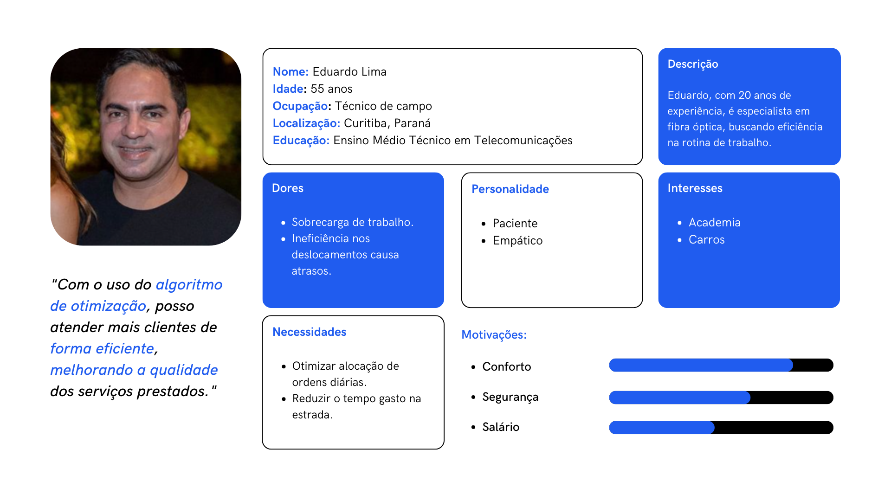

### Persona Maria - Gerente de operações
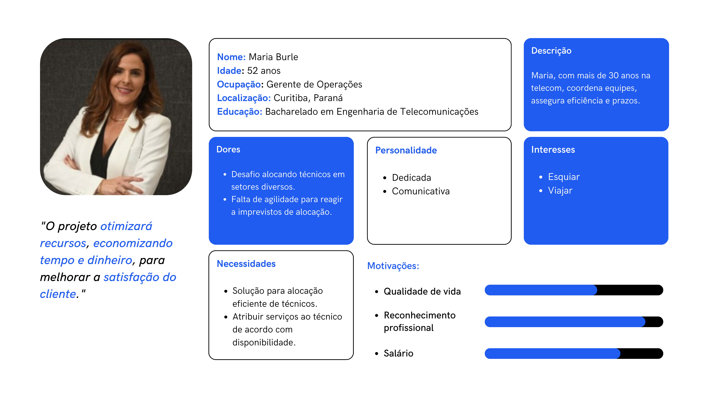

## Jornadas do Usuário
Jornadas do usuário são representações sequenciais das interações e experiências de um usuário ao interagir com um produto, serviço ou sistema, desde o início até o fim, com o objetivo de entender seu comportamento e pontos de contato ao longo desse processo.

### Jornada do Usuário do Eduardo
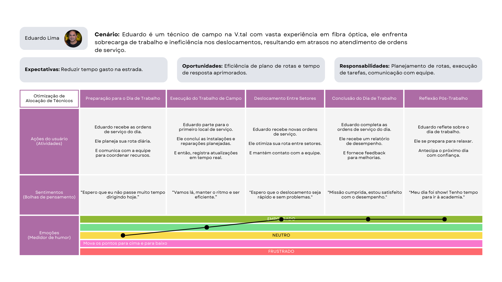

### Jornada do Usuário da Maria
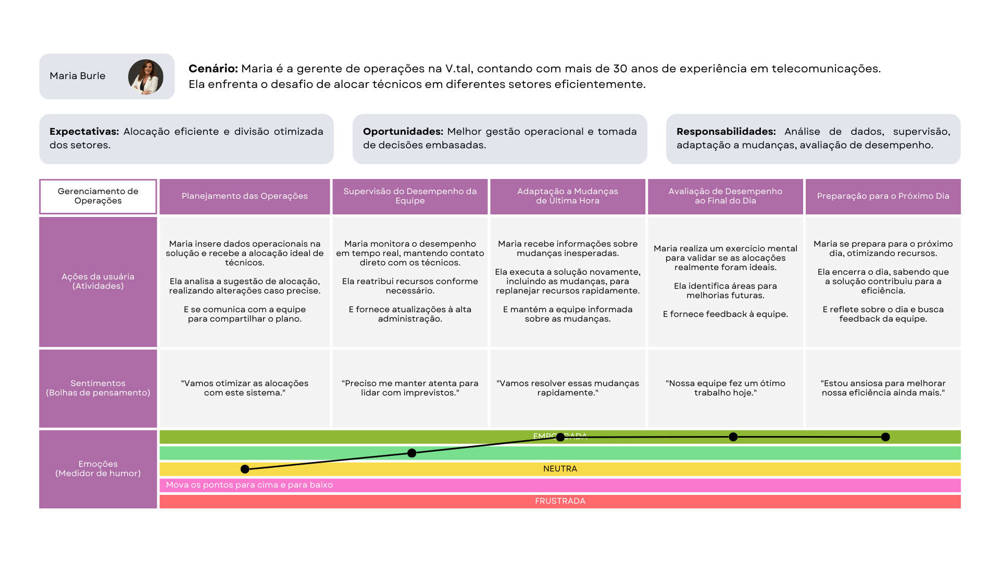

## User Stories
User stories são declarações curtas e simples que descrevem uma funcionalidade específica de um software. Elas são usadas para comunicar requisitos e prioridades de desenvolvimento de maneira ágil e compreensível.

1. Como gerente de operações, eu quero a capacidade de reatribuir recursos com rapidez, para lidar com mudanças de última hora e garantir eficiência operacional.
    - Critério de validação: Após novos inputs, a solução deve apresentar os novos resultados em, no máximo, 5 minutos.

2. Como gerente de operações, eu quero que a solução informe a alocação mais eficaz de técnicos, para resolver o desafio de alocar técnicos em setores diversos.
    - Critério de validação: A solução deve fornecer recomendações de alocação que resultem em um aumento de pelo menos 10% na eficiência operacional, conforme medido por KPIs específicos.

3. Como gerente de operações, eu quero uma entrada de dados intuitiva na solução, para não ter que perder tempo manipulando os dados antes de inseri-los.
    - Critério de validação: A maioria dos usuários, incluindo Maria, deve ser capaz de inserir dados na solução sem a necessidade de treinamento adicional.

4. Como gerente de operações, eu quero que a solução forneça dados em um formato compatível com a plataforma de gerenciamento, para não perder tempo tendo que formatar os dados depois.
    - Critério de validação: Os dados exportados pela solução devem ser compatíveis com a plataforma de gerenciamento em uso na empresa, eliminando a necessidade de qualquer conversão ou formatação adicional.

5. Como gerente de operações, eu quero que a solução leve em conta fatores como distância, garantindo alocações práticas e aplicáveis no mundo real, para lidar com limitações geográficas ao alocar técnicos.
    - Critério de validação: A solução deve ser capaz de alocar técnicos de acordo com as limitações geográficas, resultando em pelo menos 90% das alocações sendo aplicáveis no mundo real, com base em dados de campo.

6. Como gerente de operações, eu quero que a solução recomende a contratação de técnicos quando necessário, , baseando-se em dados históricos para prever situações de baixo desempenho, para manter bons indicadores de desempenho, como SLA.
    - Critério de validação: A solução recomenda a contratação quando entender que, com o contingente atual, somente 80% ou menos do SLA será atingido, com base em dados históricos.

## Wireframe
Um wireframe é um esboço visual básico de um site ou aplicativo, representando sua estrutura e layout. Abaixo, encontra-se a imagem do wireframe do website Carps.

## Mockup

O mockup de uma aplicação web é uma representação estática do design de uma interface, que mostra como a aplicação irá aparecer visualmente, mas sem a funcionalidade interativa do produto final. Ele é mais detalhado que um wireframe e menos funcional que um protótipo (que permite interação com a interface).
A realização do mockup é importante para:
Visualização de Design: Os mockups de aplicações web fornecem uma visualização precisa do layout, incluindo elementos como cabeçalhos, menus, botões, imagens, tipografia, cores e outros componentes de design.
Feedback e Testes: Os mockups são usados para apresentar ideias de design a stakeholders e usuários para coletar feedback antes de passar para as fases de codificação ou desenvolvimento.
Documentação: Funcionam como uma ferramenta de documentação para guiar os desenvolvedores sobre como a interface deve ser implementada.
Foco na Interface do Usuário (UI): Eles concentram-se na parte visual da experiência do usuário (UX), ajudando a definir a estética e a sensação que a aplicação proporcionará aos usuários finais.
Ao dar atenção a estes aspectos, os mockups se tornam uma ferramenta essencial para transformar ideias em uma aplicação web que seja não apenas funcional, mas também visualmente atraente e intuitiva para o usuário.

Uma landing page é uma página da web criada para direcionar os visitantes a realizar uma ação específica. Com um design focado e uma chamada à ação clara, ela é uma ferramenta essencial para converter visitantes em leads ou clientes. Segue abaixo imagem do mockup da landing page do projeto.

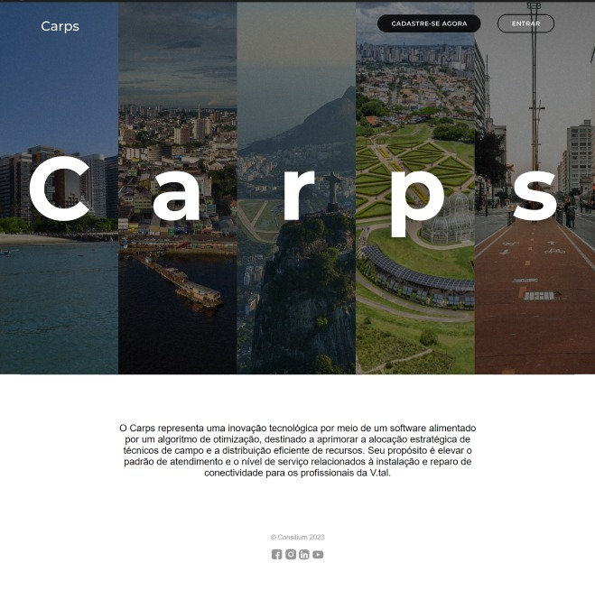

A página de cadastro é uma das primeiras páginas com as quais o usuário interage, projetada especificamente para facilitar o processo de cadastro. Ela é intuitiva e direcionada, garantindo uma experiência de usuário suave e sem complicações desde o início. Segue abaixo imagem do mockup da página de cadastro do projeto.

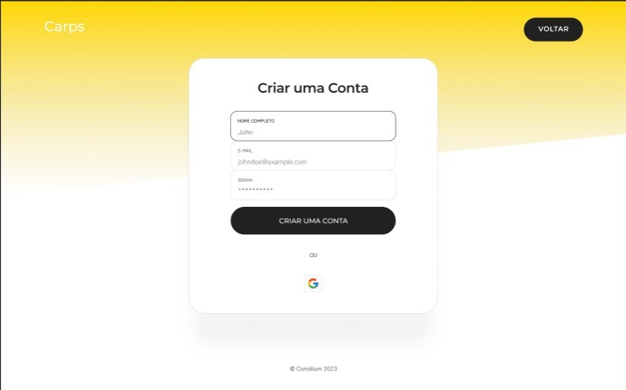 

A página de login é uma das interfaces cruciais com as quais o usuário interage, desempenhando um papel fundamental em garantir a segurança e a personalização da experiência do usuário. Ela é projetada para ser clara e eficiente, permitindo aos usuários acessar rapidamente suas contas com confiança. Segue abaixo imagem do mockup da página de login do projeto.

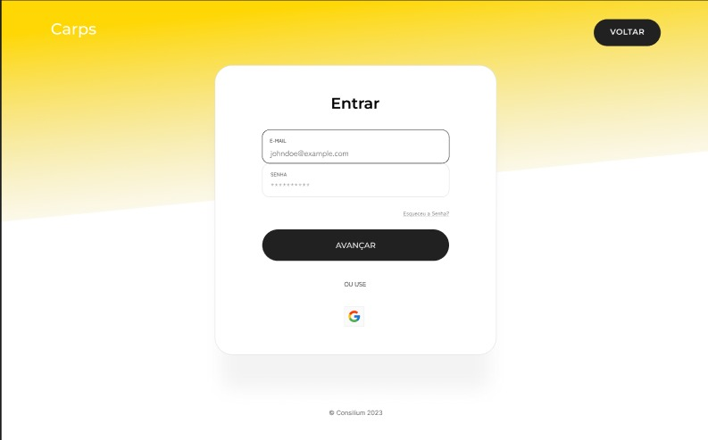

A sidebar, ou barra lateral, é um elemento de design essencial em muitas aplicações web, atuando como um painel de navegação acessível que enriquece a experiência do usuário. Estrategicamente posicionada ao lado do conteúdo principal, a sidebar facilita o acesso rápido a diferentes seções da aplicação, como perfis de usuário, configurações, funcionalidades adicionais e atalhos importantes. Segue abaixo imagem do mockup da sidebar do projeto.

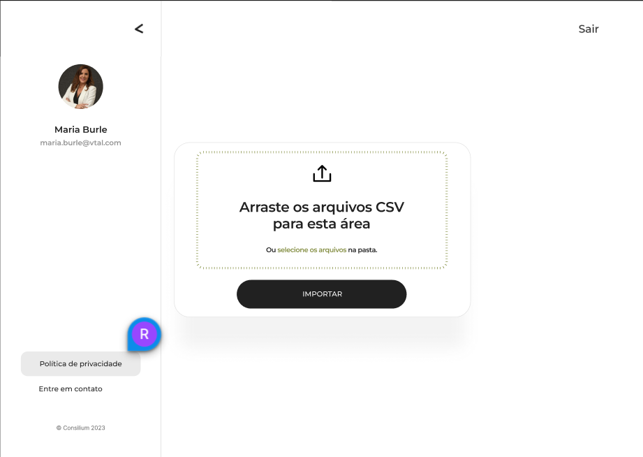

Uma página de importação é uma ferramenta que permite a transferência de dados de um local para outro. Segue abaixo imagem do mockup da página de importação do projeto.

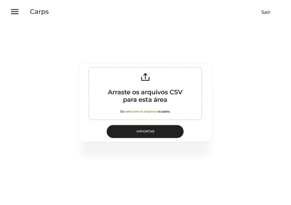

Uma página de exportação é uma ferramenta que permite a transferência de dados de um local para outro. No contexto de um site, por exemplo, você pode exportar conteúdo, como páginas, planilhas e documentos. Segue abaixo imagem do mockup da página de exportação do projeto.

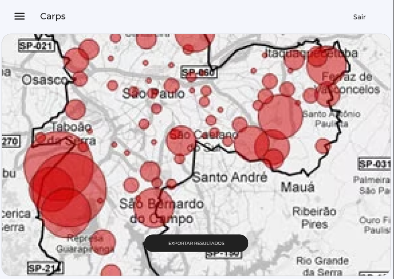

Uma página de carregamento é uma página da web que é exibida enquanto o conteúdo do site está sendo carregado, serve como um indicador visual para os usuários de que o conteúdo do site está sendo carregado, e é um aspecto importante da experiência do usuário e do desempenho do site. Segue abaixo imagem do mockup da página de carregamento do projeto.

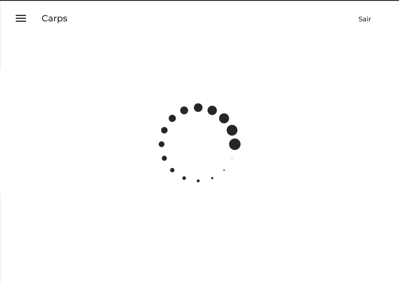

Uma página de suporte é uma seção de um site onde os usuários podem encontrar ajuda e informações para resolver problemas ou dúvidas, é crucial para fornecer um bom atendimento ao cliente e melhorar a experiência do usuário. Segue abaixo imagem do mockup da página de suporte do projeto.

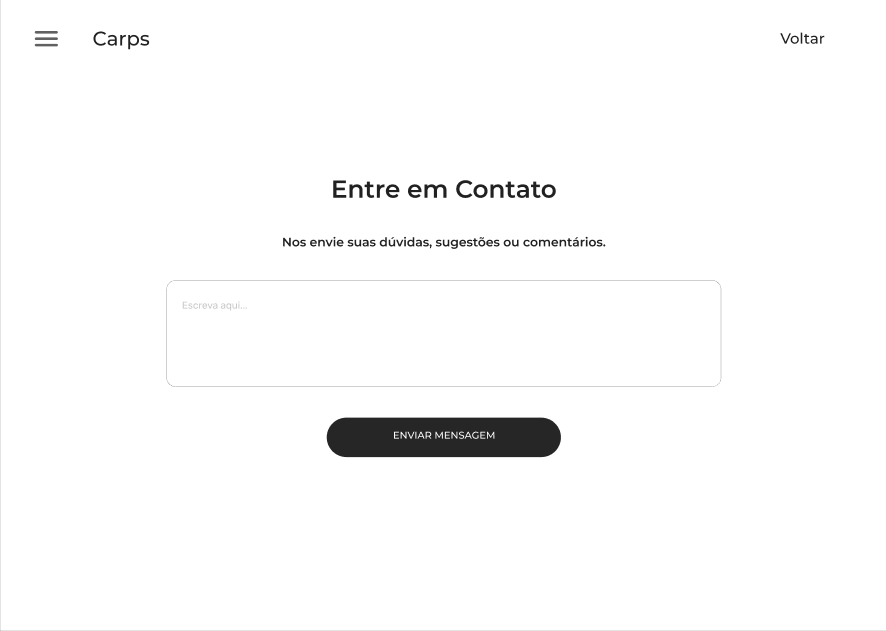