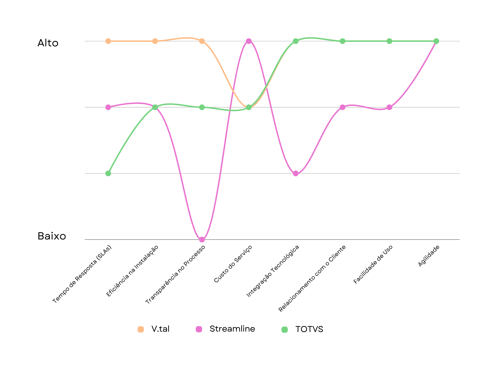
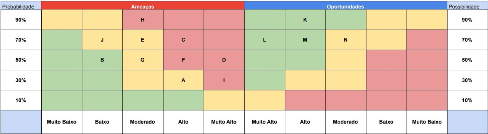
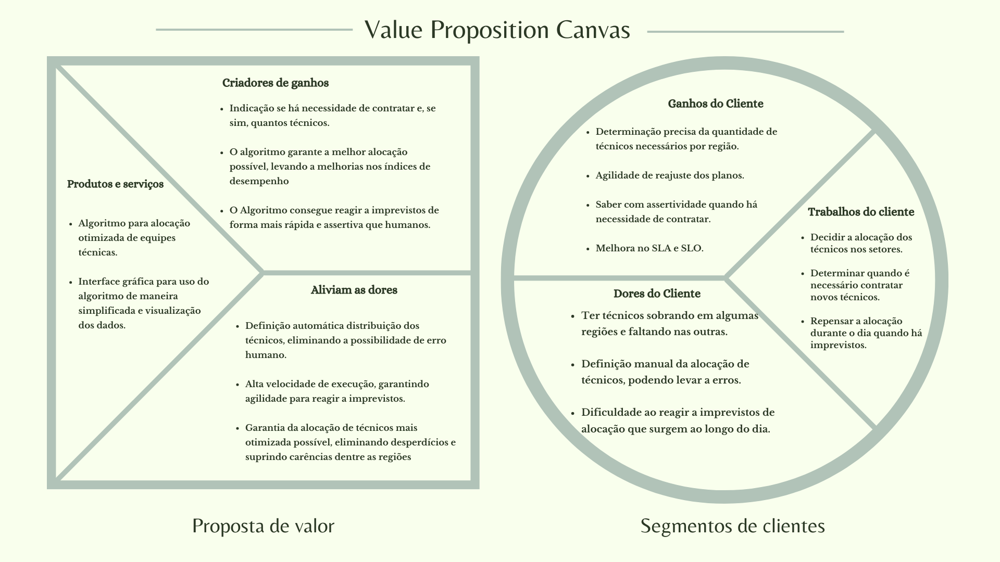

# Entendimento de negócio

## Sumário
- [Matriz Oceano Azul](#matriz-oceano-azul)
- [Matriz de Risco](#matriz-de-risco)
- [Canvas Proposta de Valor](#canvas-proposta-de-valor)
- [Análise financeira](#análise-financeira)

## Matriz Oceano Azul 

*A Estratégia do Oceano Azul*, conceituada por W. Chan Kim e Renée Mauborgne em seu livro *A Estratégia do Oceano Azul* de 2005, propõe uma abordagem inovadora para a competição de mercado. Ao invés de batalhar em mercados saturados - os "oceanos vermelhos", onde as regras são amplamente conhecidas e existe muita competição, a estratégia sugere a criação de espaços inexplorados: os "oceanos azuis". Novos territórios, onde a competição é quase inexistente, as regras ainda não foram definidas, e existe uma rica possibilidade de crescimento e lucro.

### Oceano Vermelho e Oceano Azul

- **Oceano Vermelho:** Refere-se a mercados existentes, com regras claras e competição acirrada, levando, muitas vezes, à saturação e limitando o crescimento.

- **Oceano Azul:** Envolve a descoberta ou criação de novos mercados, onde as empresas podem estabelecer regras, capturar novas demandas e crescer de maneira mais rentável, tornando a concorrência tradicional obsoleta.

### Relevância da Estratégia do Oceano Azul

A relevância da Estratégia do Oceano Azul se evidencia em diversos pontos-chave:

- **Inovação com menos risco:** A estratégia encoraja empresas a explorar novos mercados ao invés de se confinar a territórios superpovoados.

- **Crescimento lucrativo:** Criando "oceanos azuis", as empresas podem alcançar lucros e receitas mais robustos.

- **Diferenciação:** Ela permite que as empresas estabeleçam uma posição única, frequentemente a um custo reduzido, que é altamente valorizada pelos consumidores.

- **Mudança de mentalidade:** Incentiva as organizações a priorizar a inovação de valor sobre a competição acirrada.

- **Sustentabilidade:** Quando bem implementada, a estratégia pode posicionar a empresa de maneira tão única que se torna difícil para os concorrentes imitarem.

Em essência, a *Estratégia do Oceano Azul* desafia as empresas a reinventar-se, incentivando a romperem com a competição tradicional, buscando inovação e assim, criando novos valores de mercado.

### As Quatro Ações

Na estratégia são introduzidas as quatro ações, uma ferramenta que desafia as convenções setoriais para criar novas fronteiras de mercado. Elas são:

- **Reduzir:** O objetivo é diminuir os fatores que a indústria sempre superdimensiona e isso permite que as empresas reduzam seus custos e otimizem recursos, eliminando ou diminuindo aspectos do produto ou serviço que não agregam valor significativo ao consumidor.

- **Eliminar:** O objetivo é remover os fatores que a indústria sempre considerou como padrão e assim eliminar características ou serviços desnecessários que não são essenciais para os clientes, as empresas podem criar ofertas mais enxutas e diferenciadas, e muitas vezes a um custo mais baixo.

- **Aumentar:** O objetivo é intensificar fatores bem acima do padrão da indústria para elevar certos aspectos do produto ou serviço acima das expectativas tradicionais, as empresas podem se destacar dos concorrentes e criar um valor percebido mais alto para os consumidores.

- **Criar:** O objetivo é introduzir novos fatores que a indústria nunca ofereceu, com isso, as empresas podem preencher lacunas de mercado e atender a necessidades não satisfeitas dos consumidores, oferecendo soluções inovadoras e conquistando um público leal.

Ou seja, incentiva as empresas a romperem com a competição tradicional e a buscar a inovação de valor que cria novos mercados.

### Incorporando as Quatro Ações no Projeto

Para incorporar efetivamente as quatro ações da matriz no âmbito do nosso projeto, identificamos oito atributos essenciais para os clientes. Após uma análise meticulosa do mercado e avaliação dos concorrentes, determinamos estratégias para nos diferenciar utilizando as seguintes abordagens: Reduzir, Eliminar, Aumentar e Criar.

Considerando a concorrência, conduzimos uma análise focada em empresas que já implementaram processos de gerenciamento de demanda automatizados ou que prestam esse tipo de serviço para outras empresas. Entre elas, destaca-se a Streamline, uma líder global em software de gestão de demanda destinado a distribuidores, varejistas e marcas. O Walmart merece menção, pois, já nos anos 80, foi um dos pioneiros na adoção de sistemas avançados de gestão de estoques. Além destas, temos a TOTVS, uma renomada empresa brasileira que oferece soluções inovadoras para várias vertentes da logística e gestão de demanda.

Neste contexto, identificamos oito atributos fundamentais para elevar nossa operação e melhor atender às expectativas dos clientes:

1. **Tempo de Resposta (SLAs - Service Level Agreement):** Este atributo é crucial na era digital. Nosso serviço de suporte oferece um tempo de resposta 30% mais rápido em comparação com a Streamline(Streamline health solutions, 2023) e 20% mais ágil do que os padrões da TOTVS(Tradingview news, 2023). Os clientes esperam respostas rápidas e, quanto mais rápido nossos técnicos responderem às demandas, maior será a satisfação e a retenção do cliente.

2. **Eficiência na Instalação:** Além de ser um sinal de profissionalismo, realizar instalações corretas na primeira tentativa minimiza inconveniências para o cliente e reduz custos associados a revisitas ou correções.

3. **Transparência no Processo:** Manter o cliente atualizado sobre o progresso de sua solicitação e a previsão de chegada do técnico é essencial para construir confiança e estabelecer uma comunicação aberta.

4. **Custo do Serviço:** Embora a qualidade seja V.tal, o preço continua sendo um fator decisivo para muitos clientes. Oferecer um serviço de alto valor a um preço competitivo pode diferenciar nossa empresa no mercado. Oferecemos um serviço de alta qualidade a um preço altamente competitivo.

5. **Integração Tecnológica:**
   - **Reduzir:** Diminuir as complicações provenientes de sistemas não integrados pode aumentar a eficiência operacional e minimizar falhas.
   - **Aumentar:** Investir em plataformas tecnológicas integradas garante uma melhor visão global e otimiza a gestão dos técnicos.
   Investimos em plataformas tecnológicas integradas para garantir um serviço excepcional, indo além do que a concorrência oferece.

6. **Relacionamento com o Cliente:** É fundamental não apenas resolver os problemas dos clientes, mas também fazê-lo de forma que supere as expectativas. Manter interações positivas e respeitosas com os clientes não apenas fortalece o relacionamento, mas também pode superar o padrão da concorrência, incentivando recomendações boca a boca.

7. **Facilidade de Uso:** Em um mundo acelerado, os clientes valorizam conveniência. Garantir uma interface ou processo amigável, onde o cliente possa agendar, reagendar ou cancelar serviços sem complicações, é V.tal. A usabilidade deve ser tão simples que seja um diferencial competitivo notável. Valorizamos a conveniência para os usuários, garantindo uma interface simples e um processo descomplicado.

8. **Agilidade:** A dinâmica do mercado atual exige rapidez na tomada de decisões. Estamos sempre prontos para nos adaptar rapidamente às mudanças do mercado. Nossa capacidade de resposta ágil nos mantém à frente da concorrência, o que nos estabelece como líderes em nosso setor.

### Matriz Oceano Azul das Empresas V.tal, Streamline e TOTVS

Aqui está uma matriz oceano azul que avalia as empresas V.tal, Streamline e TOTVS com base em oito atributos essenciais para atender às expectativas dos clientes. Os valores dos atributos para a V.tal, Streamline e TOTVS foram obtidos por meio da leitura dos sites oficiais das empresas comparadas.

## Matriz de Risco
A Matriz de Risco analisa o projeto desenvolvido pelo grupo, identificando possíveis ameaças e oportunidades. Veja a imagem:

### Legenda:

### Riscos

- A- Indicadores de Performance (SLA) não alcançados
  - Probabilidade: 30%
  - Impacto: alto
  - Se os dados sobre a localização dos técnicos e as demandas de serviço forem imprecisos ou desatualizados, o algoritmo poderá gerar recomendações ineficientes, impactando negativamente os SLAs. Assim, possui-se um impacto alto no projeto pois um dos benefícios esperados da solução é a melhora dos indicadotes, contudo, o que causaria este risco tem uma probabilidade relativamente baixa de ocorrer justamente por ser um dos pontos mais considerados durante o desenvolvimento.
  - Uma maneira de mitigar esse problema é com o estabelecimento de processos rigorosos para verificar a precisão dos dados recebidos. Considere utilizar inteligência artificial para identificar padrões anormais ou inconsistências que possam indicar dados desatualizados ou errôneos.

- B- Necessidade de treinamento
  - Probabilidade: 50%
  - Impacto: baixo
  - Com a implementação do novo sistema, existe a possibilidade de que os técnicos e a equipe de gerenciamento enfrentem desafios na sua utilização ou não compreendam completamente as funcionalidades e insights gerados pelo algoritmo. Gerando assim um impacto baixo no projeto pois o treino seria necessário com a implementação de qualquer ferramenta nova no ambiente de trabalho e a probabilidade de isto acontecer é relativamente alta porque a solução estará em uma aplicação diferente da utilizada atualmente, possuindo outros inputs e funcionalidades. 
  - Para mitigar esse problema é importante priorizar a capacitação dos técnicos e proporcionar um ambiente de aprendizado, primeiro solicitar feedback regular dos usuários para identificar áreas do sistema que podem ser confusas ou problemáticas, desenvolver materiais de treinamento intuitivo que abordem o funcionamento e comunicar claramente a importância da implementação do novo sistema.

- C- Inadequação dos dados
  - Probabilidade: 70%
  - Impacto: alto
  - A eficácia do algoritmo depende diretamente da precisão e atualização dos dados sobre a localização dos técnicos e as demandas de serviço. Dados incorretos ou desatualizados podem resultar em recomendações subótimas, afetando a eficiência das rotas e a satisfação do cliente. Desta maneira, o impacto é alto pois prejudica o uso esperado da solução e a probabilidade alta é causada pelo grande volume de técnicos no sistema e setores além de ser um processo feito manualmente.
  - Para mitigar esse problema é importante a validação dos dados ao serem inseridas no sistema e estabelecer um protocolo para revisar e auditar os dados em intervalos regulares, implementando essas estratégias, você minimiza o potencial de recomendações ineficientes, otimizando o desempenho da solução.

- D- Falhas no algoritmo
  - Probabilidade: 50%
  - Impacto: muito alto
  - Uma falha ou inadequação no algoritmo pode resultar em ineficiências na roteirização, custos adicionais, atrasos e insatisfação do cliente. Portanto, o impacto é muito alto por relacionar um risco grave para a solução, a qual é focada no algoritmo, e a probabilidade neste instante é relativamente alta por ser um conhecimento que será adquirido de maneira concomitante ao desenvolvimento do projeto.
  - Para mitigar o problema é importante a realização de testes rigorosos em diversos cenários e um sistema de feedback para os usuários.

- E- Custos de implementação inesperados
  - Probabilidade: 70%
  - Impacto: moderado
  - A complexidade inerente ao desenvolvimento e implementação de novas tecnologias, como algoritmos de otimização, pode levar a gastos não previstos inicialmente. Assim, o impacto é moderado porque o cliente possui a maior parte da infraestrutura para a implementação da solução e possui uma probabilidade alta por depender da disponibilidade de servidores internos para o uso da ferramenta, gerando um possível custo a mais.
  - Para mitigar é importante o desenvolvimento de um lanejamento estratégico, antes de se comprometer com a implementação, realizar um planejamento aprofundado que detalhe escopo, recursos e prazos, alocar uma parte do orçamento especificamente para imprevistos, garantindo recursos para situações não antecipadas, comunicação eficaz, manter stakeholders informados sobre progressos e possíveis desafios, garantindo que decisões sejam tomadas com total transparência e considerar a colaboração com consultores ou especialistas externos que tenham experiência em projetos de natureza similar, aproveitando seu know-how para prevenir ou resolver desafios.

- F- Complexidade tecnológica
  - Probabilidade: 50%
  - Impacto: alto
  - A criação e implementação de algoritmos de otimização demanda um profundo conhecimento técnico e expertise específica. Se mal desenvolvidos ou implementados de forma inadequada, esses algoritmos podem não apenas falhar em atingir os objetivos desejados, mas também levar a decisões que reduzam a eficiência operacional. Causando um impacto alto ao afetar diretamente o resultado do projeto e possuindo uma probabilidade relativamente alta pois é um risco esperado para o desenvolvimento por um dos objetivos do projeto ser a otimização de um processo complexo utilizado atualmente.
  - Para mitigar esse problema é importante garantir que a equipe envolvida no desenvolvimento é qualificada, que a implementação seja feita em fases para permitir os ajustes com base nos resultados de cada etapa e manter uma documentação detalhada do algoritmo para facilitar correções e atualizações futuras.

- G- Risco de expansão rápida
  - Probabilidade: 50%
  - Impacto: moderado
  - Expandir os serviços para novas cidades e regiões em um ritmo acelerado, sem o devido planejamento e preparação, pode levar a uma série de desafios operacionais e estratégicos. Portanto, o impacto é moderado pois ainda que afete a operação ter que expandir a solução, a expansão  relativamente afeta pouco os sistemas necessários da solução (principalmente o tamanho de servidor e possívelmente a taxa de atualização do banco de dados) e a probabilidade é relativamente alta por serem problemas comumente enfrentados em uma expansão de serviços.
  - Para mitigar deveremos entender suas particularidades, demanda e características do mercado local para entender potenciais desafios na expansão, desenvolver projetos pilotos em novas cidades para avaliar a reação de mercado e testar a eficiência do serviço.

- H- Desafio na integração de dados
  - Probabilidade: 90%
  - Impacto: moderado
  - Em um ambiente com múltiplas fontes de informação e alta rotatividade de dados, a integração correta torna-se crucial. Dessa maneira, o impacto é moderado visto que é um desafio esperado no desenvolvimento e a probabilidade é muito alta pois o volume de dados e a taxa de alteração destes dados é grande.
  - Para mitigar é importante que a solução seja robusta e centralize todos os dados relevantes, estabelecer fluxos de atualização para validar os dados e realizar treinamentos regulares para as equipes.

- I- Segurança dos dados
  - Probabilidade: 30%
  - Impacto: muito alto
  - A medida que a V.tal centraliza informações críticas sobre localizações de técnicos, demandas de instalações, detalhes de clientes e outros dados operacionais, o sistema se torna um alvo atrativo para ataques cibernéticos. Assim, o impacto é muito alto por ser uma questão altamente problemática para empresas, podendo gerar queda de receita e perda de parcerias e apresenta uma probabilidade relativamente baixa pois o projeto é desenvolvido apenas para uso interno da V.tal.
  - Para mitigar é importante utilizar padrões de segurança para proteger os dados, incluindo a criptografia avançada e o uso de redes privadas virtuais (VPN), também é importante estabelecer políticas de controle de acesso, garantindo que apenas pessoas responsáveis acessem, modifiquem e transfiram dados, e por fim implementar sistemas de detecção e resposta a intrusões (IDR) para monitorar o tráfego de rede.

- J- Dependência de conectividade
  - Probabilidade: 70%
  - Impacto: baixo
  - O algoritmo proposto para otimização e distribuição dos técnicos de campo se baseia na capacidade de receber e enviar dados em tempo real. Possuindo um baixo impacto porque os técnicos já utilizam outros sistemas com a mesma dependência e a probabilidade é alta pois é comum que o técnico passe por áreas sem conectividade ou perca a conectividade durante serviços em regiões mais isoladas. 
  - Para mitigar é importante preparar os técnicos para operar em condições de baixa conectividade e investir em infraestrutura.

### Oportunidades

- K- Melhora na eficiência operacional
  - Probabilidade: 90%
  - Impacto: alto
  - Ao implementar o algoritmo de otimização, a V.tal tem o potencial de revolucionar suas operações. Uma alocação mais inteligente e estratégica dos técnicos, baseada em dados precisos e atualizações em tempo real, pode resultar em menores tempos de deslocamento, redução de custos operacionais e melhor aproveitamento do tempo de trabalho dos técnicos. Desta forma, o impacto é alto pois o processo é feito manualmente por operadores, fazendo com que a solução aumente consideravelmente a velocidade de mudanças e a probabilidade é muito alta porque é um dos objetivos diretos do projeto. Isso não só aumenta a produtividade como também pode melhorar a satisfação dos técnicos e dos clientes, levando a um serviço de instalação e reparo mais ágil e eficaz.

- L- Redução de custos
  - Probabilidade: 70%
  - Impacto: muito alto
  - Implementando o algoritmo de otimização, a V.tal tem o potencial de identificar e eliminar ineficiências no deslocamento e alocação dos técnicos. Portanto, o impacto é muito alto pois o projeto reduzirá o tempo de atualização dos dados, agilizando o processo dos operadores e a probabilidade é alta por ser um dos objetivos durante o desenvolvimento do projeto.
  - Esta eficiência pode traduzir-se em economias significativas ao minimizar tempos de viagem desnecessários, reduzir horas extras pagas e otimizar a utilização de recursos. Além disso, ao evitar deslocamentos desnecessários, pode haver uma diminuição no desgaste de veículos e no consumo de combustível, resultando em economias adicionais e uma operação mais sustentável.

- M- Otimização de recursos
  - Probabilidade: 70%
  - Impacto: alto
  - A implementação do algoritmo de otimização proporciona uma distribuição mais estratégica dos técnicos, equilibrando as cargas de trabalho. Assim, o impacto é alto visto que com uma otimização do trabalho dos operadores reduz o tempo de tomada de decisão, agilizando o tempo de resposta para um serviço e a probabilidade alta pois é um dos objetivos do projeto.
  - Isso garante que nenhum técnico fique ocioso por falta de tarefas, enquanto outros podem estar sobrecarregados. Este equilíbrio não apenas maximiza a produtividade da força de trabalho, mas também pode melhorar a satisfação e retenção dos técnicos, ao evitar situações de estresse e burnout. Em última análise, isso conduz a uma maior eficiência operacional e satisfação do cliente, à medida que os SLAs são consistentemente atendidos ou superados.

- N- Expansão de serviços
  - Probabilidade: 70%
  - Impacto: moderado
  - A implementação do algoritmo de otimização proporciona uma distribuição mais estratégica dos técnicos, equilibrando as cargas de trabalho. Assim, o impacto moderado porque a expansão traria a necessidade de administração de mais setores, um ponto de otimização que o projeto busca melhorar e a probabilidade é alta pois é esperado que as operações da V.tal tenham uma expansão.
  - Isso garante que nenhum técnico fique ocioso por falta de tarefas, enquanto outros podem estar sobrecarregados. Este equilíbrio não apenas maximiza a produtividade da força de trabalho, mas também pode melhorar a satisfação e retenção dos técnicos, ao evitar situações de estresse e burnout. Em última análise, isso conduz a uma maior eficiência operacional e satisfação do cliente, à medida que os SLAs são consistentemente atendidos ou superados.

## Canvas Proposta de Valor

O Canvas da proposta de valor é composto por dois blocos principais: o perfil do cliente e a proposta de valor. O perfil do cliente é dividido em três partes: tarefas dos clientes, dores dos clientes e ganhos do cliente. A proposta de valor também é dividida em três partes: produtos e serviços, aliviadores de dores e criadores de ganhos. Conforme busca-se as informações para que ela seja preenchida corretamente, é possível identificar e validar as hipóteses sobre as necessidades dos clientes e ajustar a proposta de valor de acordo com os insights obtidos. Veja a imagem abaixo:

## Análise Financeira

Na análise financeira do projeto, foram meticulosamente consideradas as projeções de custos e receitas relacionadas ao seu desenvolvimento. A análise financeira desempenha um papel fundamental, permitindo compreender o valor do investimento previsto, assim como estimar os gastos e ganhos ao longo de um ano.

Essa avaliação atua como um guia essencial para os parceiros envolvidos no projeto, possibilitando que avaliem a viabilidade econômica do empreendimento. Ao estabelecer as projeções de custos, o foco é identificar todos os gastos associados à implementação e manutenção do projeto, abrangendo despesas operacionais, custos de produção, despesas com pessoal e outros encargos pertinentes.

Por outro lado, é crucial projetar as receitas para que os parceiros possam visualizar os potenciais fluxos de entrada provenientes da operação do projeto. Mesmo em projetos internos sem vendas diretas, essa análise é indispensável, pois pode resultar na redução de custos internos e trazer benefícios como aumento na eficiência e diminuição de riscos operacionais, que podem ser complexos de mensurar com precisão.

Consequentemente, no escopo deste projeto, os custos incluem despesas relacionadas ao desenvolvimento de software, infraestrutura de TI e custos operacionais para manutenção e suporte.

### Custo de Desenvolvimento de Software

Estima-se que o projeto possa ser concluído em três meses com seis desenvolvedores, considerando que eles possuam habilidades de nível pleno. Com base no salário médio de um desenvolvedor pleno, que é de R$ 5.115, de acordo com a fonte da <a href="https://www.betrybe.com/guia-salarios-profissoes/programador">Trybe, 2020-2021 </a>, considerando que, em média, os impostos e encargos atribuídos a um funcionário representam um custo adicional de 68% para a empresa e conforme mencionado na fonte da <a href="https://paraempresas.catho.com.br/quanto-custa-um-funcionario-para-empresa/#:~:text=Assim%2C%20sua%20despesa%20geral%20com,pagamento%20de%20impostos%20e%20tributos.">Catho, 2022</a>, podemos calcular que o custo de desenvolvimento de software é de aproximadamente R$ 147.312.

### Infraestrura de TI

Levando em consideração que o custo médio dos equipamentos necessários para o desenvolvimento do software é de R$ 2.745 , conforme mencionado na fonte do <a href="https://www.techtudo.com.br/listas/2022/11/notebook-para-programar-6-laptops-por-a-partir-de-r-2745.ghtml">Freitas, 2022</a>, o custo inicial da infraestrutura de TI é aproximadamente R$ 16.470.

### Custos Operacionais para Manutenção e Suporte

Considerando a possibilidade de precisar de um desenvolvedor pleno para a manutenção contínua do software, bem como os custos dos serviços de nuvem para armazenamento do software, com uma instância localizada na região da América do Norte (N. Virginia) a um custo médio de cerca de $29,95 por mês, 100 GB de armazenamento em bloco a um custo de $10,00 por mês e uma transferência de dados de 1 TB por mês a um custo de $90,00, o gasto total mensal para manter o software na AWS, com uma média de 100 usuários diários, seria aproximadamente $129,95.

Com base na taxa de câmbio comercial atual do dólar, que é de 5.02, o valor seria aproximadamente R$ 652.35. Portanto, o custo operacional para manutenção e suporte seria aproximadamente R$ 8.836,35.

Consequentemente, o custo total durante o primeiro ano seria de R$ 147.312 fixos para os três primeiros meses de desenvolvimento do software, R$ 16.470 para a infraestrutura de TI como custo fixo e R$ 79.527,15 para os 9 meses seguintes como despesas de manutenção e suporte para o software já desenvolvido. Isso totaliza R$ 243.309,15 para o primeiro ano.

### Projeção de Receitas

Apesar de ser um projeto interno da V.tal, este projeto tem um grande impacto nas receitas da empresa, considerando vários fatores mencionados anteriormente. Podemos medir o ganho na produtividade do planejador e sua eficiência, juntamente com a redução de custos operacionais, possibilitando o crescimento da empresa V.tal. Além disso, existem benefícios mais complexos de mensurar, como a melhoria na satisfação dos clientes, o que inclui empresas de fibra ótica, bem como oportunidades de Upsell e Cross-sell. Ao atender os clientes de maneira eficaz e eficiente, a empresa pode identificar oportunidades de oferecer serviços adicionais ou atualizados, reduzindo penalidades e multas associadas ao não cumprimento dos acordos de nível de serviço.

Também é importante considerar a economia resultante da redução dessas penalidades, o que pode contribuir diretamente para a receita da empresa, além do uso desta plataforma em vez de plataformas terceirizadas que foram citadas e que incorrem em altos custos.

Podemos mensurar a melhoria na produtividade em 30% (<a href="https://www.linkedin.com/pulse/future-workforce-management-case-study-workstatus-workstatus">Workstatus, 2023</a>). Considerando que cada planejador ganha em média R$ 8.000 por mês (fonte: Glassdoor) e levando em consideração a informação fornecida em um workshop com a V.tal de que eles possuem cerca de 100 planejadores, podemos estimar um aumento de produtividade anual de aproximadamente R$ 2.880.000.

Além disso, considerando outros fatores, como a melhoria nos serviços e o crescimento da V.tal resultantes deste software, baseado em pesquisas,  (<a href="https://www.greatplacetowork.com/resources/blog/automated-workforce-planning-tactical-or-strategic">Gorman C, 2015 </a>) , que indicam um aumento mínimo de 8% no faturamento após a implementação de um bom WFM e considerando o valor da V.tal de R$ 4,9 bilhões em 2022 (<a href="https://teletime.com.br/11/04/2023/v-tal-tem-receita-de-r-49-bilhoes-em-2022-mas-fecha-ano-com-prejuizo/#:~:text=V.-,tal%20tem%20receita%20de%20R%24%204%2C9%20bilh%C3%B5es%20em%202022,mas%20fecha%20ano%20com%20preju%C3%ADzo&text=A%20operadora%20de%20infraestrutura%20V,l%C3%ADquido%20de%20R%24%20443%20milh%C3%B5es.">Julião, H. 2022 </a>), projetamos um aumento anual na receita de aproximadamente R$ 392.000.000. Portanto, podemos concluir que a receita total resultante da construção deste sistema é de no mínimo R$ 394.880.000. É importante ressaltar que este cálculo não considera possíveis custos de um sistema de WFM já utilizado atualmente, e outros fatores mais complexos de mensurar, conforme mencionado anteriormente.

Fontes: 
Trybe, Salário de Programador: quanto ganha e o que faz. 2020-2021, Disponível em: https://www.betrybe.com/guia-salarios-profissoes/programador. Acesso em: 19 out. 2023.

Equipe Catho Empresas, Você sabe quanto custa um funcionário para a empresa?. Barueri - SP, 2022. Disponível em: https://paraempresas.catho.com.br/quanto-custa-um-funcionario-para-empresa/#:~:text=Assim%2C%20sua%20despesa%20geral%20com,pagamento%20de%20impostos%20e%20tributos. Acesso em: 19 out. 2023.

Freitas, A. L. et al TechTudo, Notebook para programar: 6 laptops por a partir de R$ 2.745. 2022. Disponível em: https://www.techtudo.com.br/listas/2022/11/notebook-para-programar-6-laptops-por-a-partir-de-r-2745.ghtml. Acesso em 19 out. 2023.

Workstatus, Management: A Case Study by Workstatus. 2023. Disponível em: https://www.linkedin.com/pulse/future-workforce-management-case-study-workstatus-workstatus/. Acesso em 19 out. 2023.

Gorman C. et al. Great place to work, Automated Workforce Planning: Tactical or Strategic?. 2015. Disponível em: https://www.greatplacetowork.com/resources/blog/automated-workforce-planning-tactical-or-strategic. Acesso em 19 out. 2023.

Julião, H. et al. Teletime, V.tal tem receita de R$ 4,9 bilhões em 2022, mas fecha ano com prejuízo. 2023. Disponível em: https://teletime.com.br/11/04/2023/v-tal-tem-receita-de-r-49-bilhoes-em-2022-mas-fecha-ano-com-prejuizo/. Acesso em 19 out. 2023.

V.TAL. V.tal apresenta novo projeto de Edge Data Center em Porto Alegre. 2023. Disponível em: www.vtal.com/press. Acesso em: 9 nov. 2023​

STREAMLINE HEALTH SOLUTIONS. Streamline Health. To Report Second Quarter 2023 Financial Performance and Provide Corporate Update. 2023. Disponível em: https://www.tradingview.com/news/reuters.com,2023-09-06:newsml_GNX7bfQkN:0-streamline-health-to-report-second-quarter-2023-financial-performance-and-provide-corporate-update/. Acesso em: 9 nov. 2023

TRADINGVIEW NEWS. Brazil's Totvs jumps after Q3 results 'strong across the board'. 2023. Disponível em: https://www.tradingview.com/news/reuters.com,2023:newsml_L1N3C91PX:0-brazil-s-totvs-jumps-after-q3-results-strong-across-the-board/. Acesso em: 9 nov. 2023​