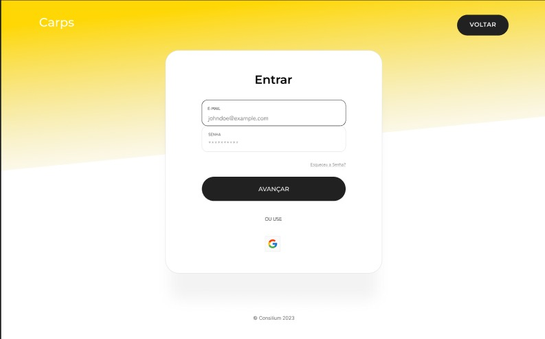

# Manual Do Usuário

## Sumário
- [Abrindo a solução pela primeira vez](#abrindo-a-solução-pela-primeira-vez)
- [Cadastro](#cadastro)
- [Login](#login)
- [Importação de dados](#importação-de-dados)
- [Esperando os resultados de alocação](#esperando-os-resultados-de-alocação)
- [Página de exportação](#página-de-exportação)

## Abrindo a solução pela primeira vez

Quando você abrir a solução pela primeira vez, você verá uma tela de apresentação do projeto, com informações introdutórias se arrastar para baixo. Caso você não possua uma conta ainda, a próxima página a visitar deve ser a página de cadastro.
## Cadastro

Aqui você deve criar uma conta, indicando email e senha.
## Login

Uma vez que você tiver sua conta criada, você deve se logar, inserindo as informações que você usou para criar a sua conta.
## Importação de dados

Depois de ter se logado, a solução vai te apresentar as páginas relativas ao algoritmo em si. O primeiro passo realizar a importação dos dados necessários para o sistema. Você pode realizar isso arrastando os arquivos para a área pontilhada designada, ou clicano no botão "Importar" e selecionando os arquivos no seu sistema.
## Esperando os resultados de alocação

Após todos os dados serem inseridos, a solução vai pedir que você espere até que o cálculo da alocação ideal seja realizado. Esse processo não deve durar mais de dez segundos.
## Página de exportação

Quando o algoritmo definir a alocação ideal a solução vai te encaminhar para a página de exportação, onde você encontra uma série de visualizações dos resultados, e a possibilidade de baixar esses resultados no formato csv, clicando no botão "Exportar dados".