# Testes de integração

## Sumário
- [Integração do Algoritmo](#integração-do_algoritmo)
    - [Teste 1](#teste-1)
    - [Teste 2](#teste-2)
    - [Teste 3](#teste-3)
- [Integração Cadastro](#integração-cadastro)
    - [Página de cadastro](#página-de-cadastro)

## Integração do Algoritmo

### Teste 1
#### Arquivos adicionados:
dfPedidos.csv - ./codigo/dados/dadosTesteFluxoGeral/dfPedidos.csv
 
dfTecnicos.csv - ./codigo/dados/dadosTesteFluxoGeral/dfTecnicos.csv

#### Resultado enviado pelo back
{"finalList":[[0,0,1],[0,0,1]],"hgindex":0.3426307618180845}
 
(Os dois técnicos foram alocados no setor 3)

#### Resultados exibidos no front

##### Gráfico de barras
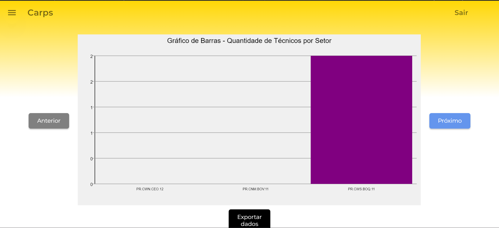

##### Gráfico de círculos
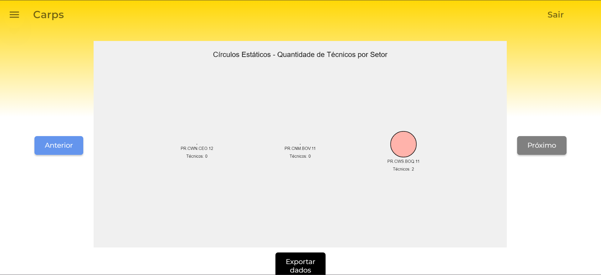

##### CSV gerado
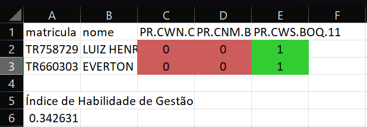

### Teste 2
#### Arquivos adicionados:
dfPedidos_teste1.csv - ./codigo/dados/dadosTesteFuncionamento/dfPedidos_teste1.csv
 
dfTecnicos_teste1.csv - ./codigo/dados/dadosTesteFuncionamento/dfTecnicos_teste1.csv

#### Resultado enviado pelo back
{"finalList":[[0,0,0,0,1,0,0],[0,1,0,0,0,0,0],[0,0,0,0,0,1,0],[0,1,0,0,0,0,0],[0,1,0,0,0,0,0],[1,0,0,0,0,0,0],[0,0,1,0,0,0,0],[0,0,0,0,1,0,0],[0,1,0,0,0,0,0],[0,0,0,0,1,0,0]],"hgindex":0.22471825948217428}

#### Resultados exibidos no front

##### Gráfico de barras
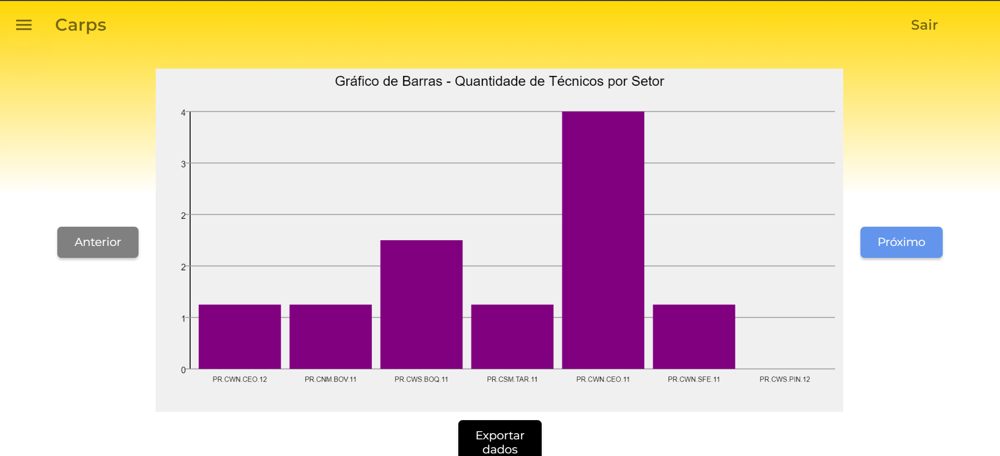

##### Gráfico de círculos
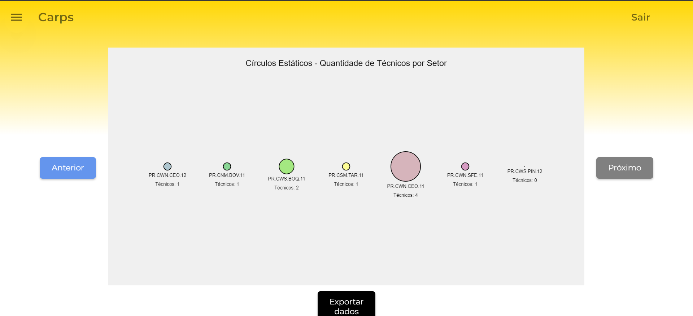

##### CSV gerado
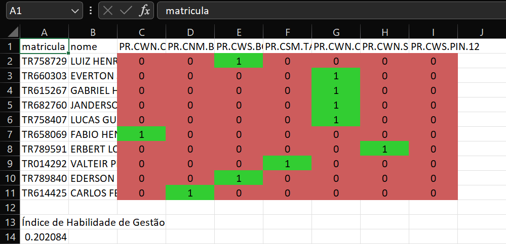

### Teste 3
#### Arquivos adicionados:
dfPedidos_teste2.csv - ./codigo/dados/dadosTesteFuncionamento/dfPedidos_teste2.csv
 
dfTecnicos_teste2.csv - ./codigo/dados/dadosTesteFuncionamento/dfTecnicos_teste2.csv

#### Resultado enviado pelo back
{"finalList":[[0,0,1,0,0,0,0,0,0,0,0,0],[1,0,0,0,0,0,0,0,0,0,0,0],[0,1,0,0,0,0,0,0,0,0,0,0],[0,0,0,1,0,0,0,0,0,0,0,0],[0,0,0,0,0,0,0,1,0,0,0,0],[1,0,0,0,0,0,0,0,0,0,0,0],[1,0,0,0,0,0,0,0,0,0,0,0],[0,0,1,0,0,0,0,0,0,0,0,0],[0,0,0,0,0,0,0,0,1,0,0,0],[0,0,0,0,0,0,1,0,0,0,0,0],[0,0,0,0,0,0,0,1,0,0,0,0],[0,0,0,0,1,0,0,0,0,0,0,0],[0,0,0,0,0,0,0,1,0,0,0,0],[0,0,0,0,0,1,0,0,0,0,0,0],[0,0,0,0,0,0,0,1,0,0,0,0],[0,0,0,0,0,0,0,0,0,1,0,0],[0,0,1,0,0,0,0,0,0,0,0,0],[0,1,0,0,0,0,0,0,0,0,0,0],[0,0,0,0,1,0,0,0,0,0,0,0],[0,0,0,0,0,0,1,0,0,0,0,0],[0,0,0,0,0,0,0,0,0,0,1,0],[0,0,0,0,0,0,0,0,0,0,0,1],[0,0,0,0,0,0,0,0,0,0,1,0],[0,0,0,0,0,0,0,0,0,0,0,1],[0,0,0,0,0,0,1,0,0,0,0,0],[0,0,0,0,0,1,0,0,0,0,0,0],[0,0,0,0,0,0,0,0,0,0,1,0],[1,0,0,0,0,0,0,0,0,0,0,0],[0,1,0,0,0,0,0,0,0,0,0,0],[1,0,0,0,0,0,0,0,0,0,0,0],[0,0,0,0,0,0,1,0,0,0,0,0],[0,0,0,0,0,0,0,0,0,0,1,0],[0,0,0,0,1,0,0,0,0,0,0,0],[0,0,1,0,0,0,0,0,0,0,0,0],[0,0,0,0,0,1,0,0,0,0,0,0],[0,0,0,0,1,0,0,0,0,0,0,0],[0,0,0,1,0,0,0,0,0,0,0,0],[0,0,0,1,0,0,0,0,0,0,0,0],[1,0,0,0,0,0,0,0,0,0,0,0],[1,0,0,0,0,0,0,0,0,0,0,0],[0,0,0,0,0,0,0,0,0,1,0,0],[0,0,0,0,0,0,0,1,0,0,0,0],[0,0,0,0,0,1,0,0,0,0,0,0],[0,0,0,0,0,1,0,0,0,0,0,0],[0,0,0,0,0,1,0,0,0,0,0,0],[0,0,0,0,0,0,0,0,0,1,0,0],[0,0,0,0,0,0,0,0,0,1,0,0],[0,0,0,0,0,1,0,0,0,0,0,0],[0,0,0,0,0,0,0,0,0,1,0,0],[0,0,0,0,0,0,0,1,0,0,0,0],[0,1,0,0,0,0,0,0,0,0,0,0],[0,0,0,0,0,0,0,0,0,1,0,0],[1,0,0,0,0,0,0,0,0,0,0,0],[0,0,0,0,0,0,0,1,0,0,0,0],[1,0,0,0,0,0,0,0,0,0,0,0],[0,0,0,1,0,0,0,0,0,0,0,0],[0,1,0,0,0,0,0,0,0,0,0,0],[0,0,0,0,0,0,0,0,0,1,0,0],[0,0,0,0,0,0,0,1,0,0,0,0],[0,0,0,0,0,0,1,0,0,0,0,0],[0,1,0,0,0,0,0,0,0,0,0,0],[0,0,0,0,0,0,0,0,0,0,1,0],[0,0,0,0,0,0,1,0,0,0,0,0],[0,0,0,0,0,0,0,0,0,0,0,1],[0,0,0,0,0,0,0,0,0,1,0,0],[0,0,0,0,0,0,0,1,0,0,0,0],[0,0,0,0,0,0,0,0,0,0,0,1],[1,0,0,0,0,0,0,0,0,0,0,0],[0,0,0,0,1,0,0,0,0,0,0,0],[0,0,0,0,0,1,0,0,0,0,0,0],[0,0,0,0,1,0,0,0,0,0,0,0],[0,0,0,0,0,0,1,0,0,0,0,0],[0,0,0,1,0,0,0,0,0,0,0,0],[0,0,0,0,0,0,0,1,0,0,0,0],[0,0,0,0,0,0,0,1,0,0,0,0],[0,0,0,0,0,1,0,0,0,0,0,0],[0,0,0,0,0,0,0,0,0,1,0,0],[0,0,0,1,0,0,0,0,0,0,0,0],[0,0,1,0,0,0,0,0,0,0,0,0],[0,1,0,0,0,0,0,0,0,0,0,0],[0,0,0,0,0,0,0,0,1,0,0,0],[0,0,0,0,0,0,0,0,0,0,1,0],[0,0,0,0,0,0,0,0,0,1,0,0],[0,0,0,1,0,0,0,0,0,0,0,0],[0,0,0,0,0,0,1,0,0,0,0,0],[0,0,0,0,0,1,0,0,0,0,0,0],[1,0,0,0,0,0,0,0,0,0,0,0],[0,0,0,0,0,0,0,1,0,0,0,0],[0,0,0,0,0,0,0,1,0,0,0,0],[0,0,0,0,0,0,0,0,0,0,0,1],[0,0,0,0,0,1,0,0,0,0,0,0],[0,0,0,0,0,0,0,0,0,1,0,0],[0,0,0,0,0,0,0,0,0,1,0,0],[0,0,0,0,0,0,0,0,0,0,1,0],[0,0,0,1,0,0,0,0,0,0,0,0],[0,0,0,0,0,1,0,0,0,0,0,0],[1,0,0,0,0,0,0,0,0,0,0,0],[1,0,0,0,0,0,0,0,0,0,0,0],[0,0,0,0,1,0,0,0,0,0,0,0],[0,0,0,1,0,0,0,0,0,0,0,0],[0,0,1,0,0,0,0,0,0,0,0,0],[1,0,0,0,0,0,0,0,0,0,0,0],[0,0,0,0,0,0,0,0,0,0,1,0],[0,0,0,0,1,0,0,0,0,0,0,0],[0,0,0,0,0,0,0,0,0,0,1,0],[0,0,0,0,0,0,0,1,0,0,0,0],[0,0,0,0,0,0,0,1,0,0,0,0],[0,0,0,0,0,0,0,0,0,0,0,1],[0,0,0,0,1,0,0,0,0,0,0,0],[0,1,0,0,0,0,0,0,0,0,0,0],[1,0,0,0,0,0,0,0,0,0,0,0],[0,0,0,0,0,0,0,1,0,0,0,0],[0,0,1,0,0,0,0,0,0,0,0,0],[0,0,0,0,1,0,0,0,0,0,0,0],[0,0,1,0,0,0,0,0,0,0,0,0],[0,0,0,0,0,0,0,0,0,0,0,1],[0,0,0,0,0,0,1,0,0,0,0,0],[0,0,0,1,0,0,0,0,0,0,0,0],[0,0,0,0,0,0,0,0,0,0,1,0],[0,0,0,0,0,0,0,0,0,1,0,0],[0,0,0,0,0,0,0,1,0,0,0,0],[0,0,0,0,0,0,0,0,0,0,0,1],[0,0,0,0,0,0,1,0,0,0,0,0],[0,0,0,1,0,0,0,0,0,0,0,0],[0,1,0,0,0,0,0,0,0,0,0,0]],"hgindex":0.12542469666014647}

#### Resultados exibidos no front

##### Gráfico de barras
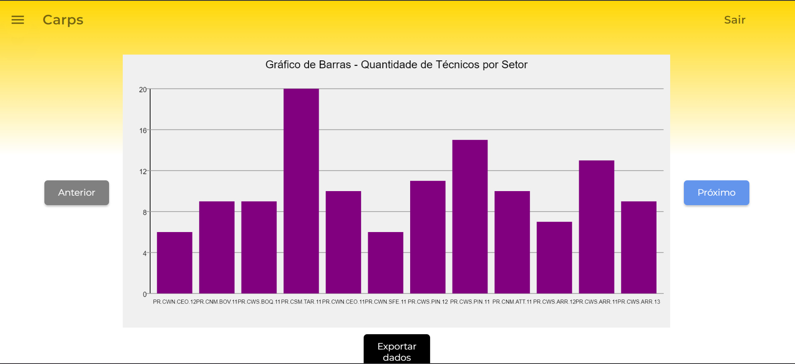

##### Gráfico de círculos
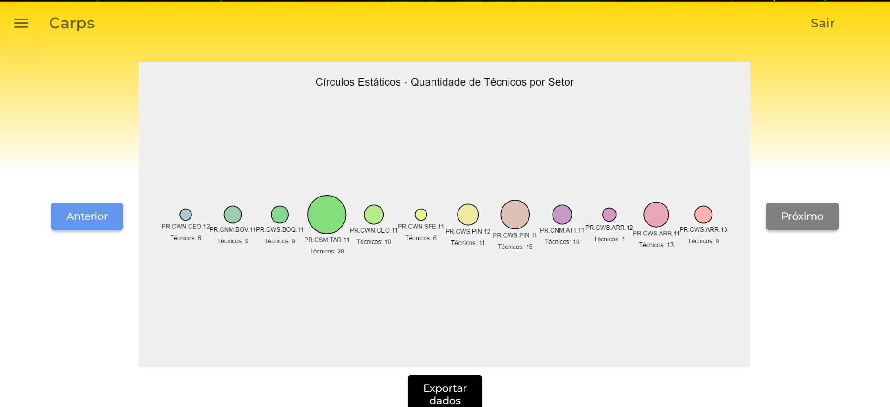

##### CSV gerado
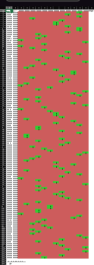
 
Como o csv é muito grande para conseguir mostrar os detalhes, aqui há um zoom na habilidade de gestão, demonstrando que bate com a enviada pelo back
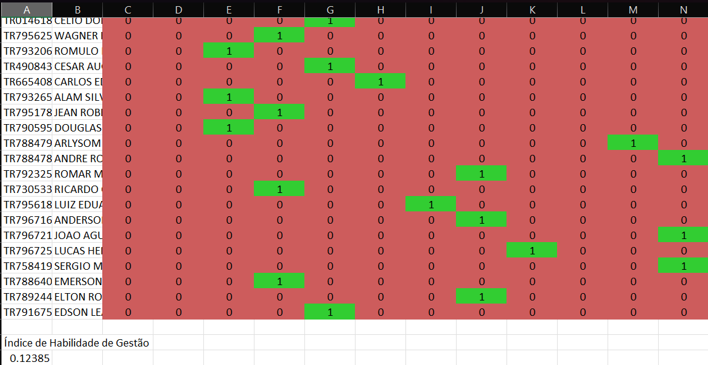

## Integração Cadastro

### Página de cadastro

Este documento tem como objetivo detalhar o processo de integração da página de cadastro com o sistema backend. A página de cadastro é uma interface essencial para qualquer aplicação digital, agindo como o primeiro ponto de contato entre o usuário e o serviço. 

#### Resposta ao submeter informações
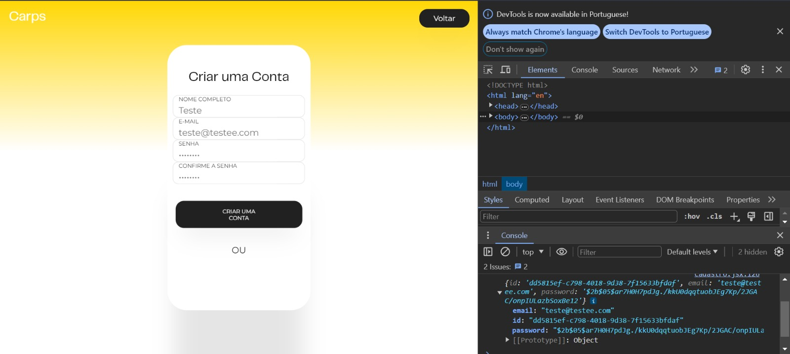

A imagem apresenta o processo de criação de uma conta, mostrando a transferência segura de informações como e-mail, nome e senha para o backend. Este processo inclui a validação dos dados inseridos, com destaque para a criptografia da senha, assegurando a proteção contra interceptações e acessos não autorizados. 

### Recebimento dos dados

A imagem retrata uma extensão do Visual Studio Code utilizada para visualizar APIs, na qual se observa o recebimento de uma resposta enviada pelo front-end. Este momento captura a interface da extensão exibindo detalhes cruciais da interação entre o front-end e o back-end: o tipo de requisição efetuada, o status da resposta, e os dados específicos retornados pelo back-end.
