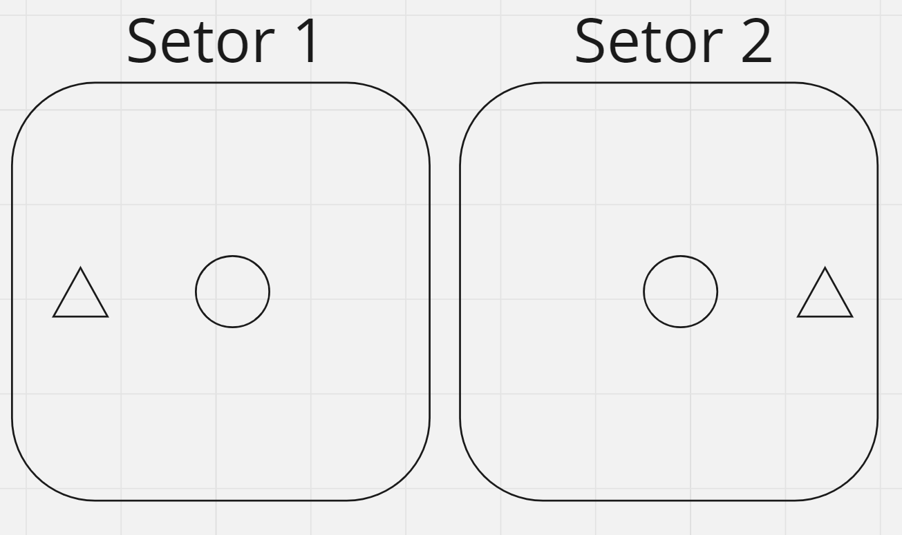
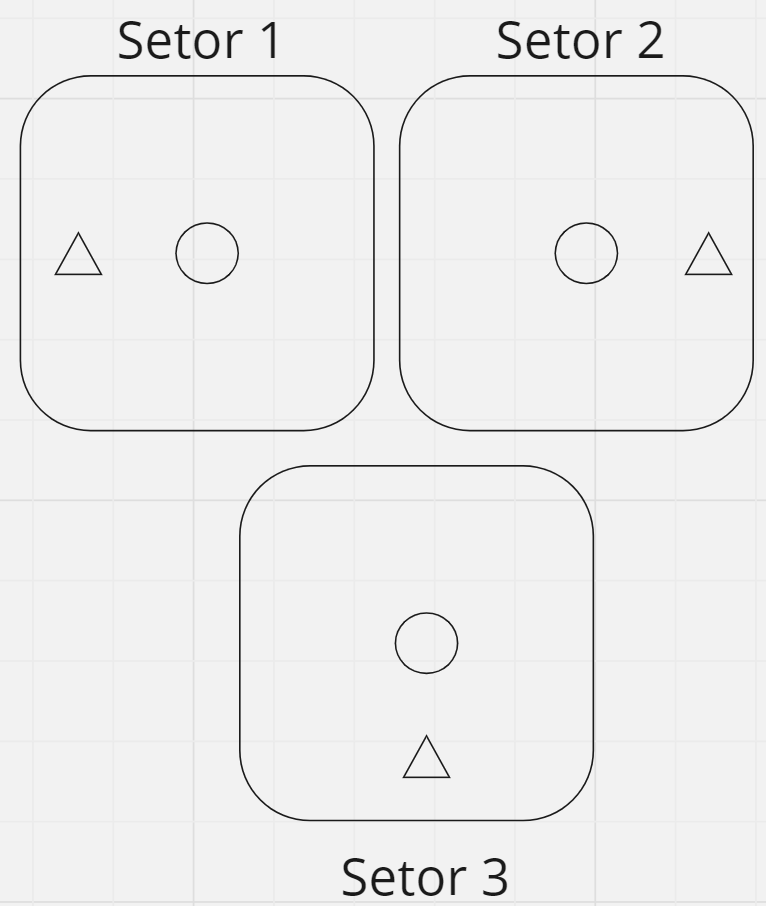
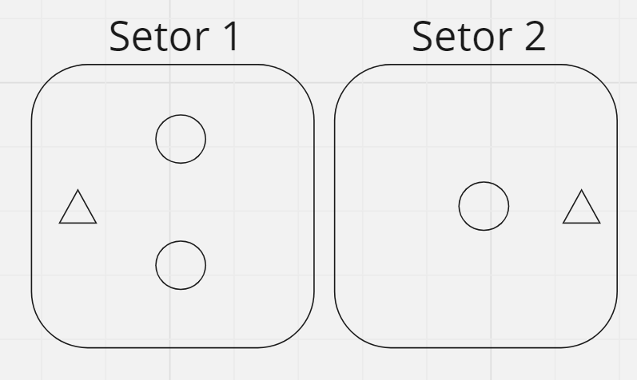
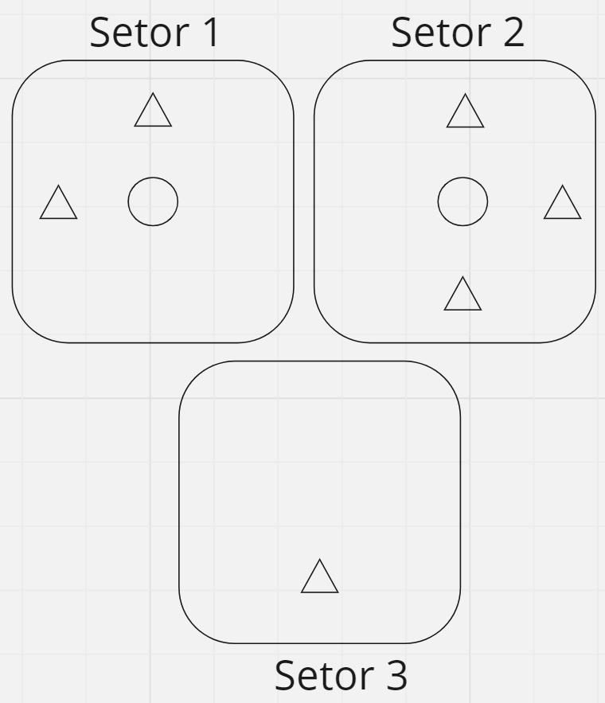
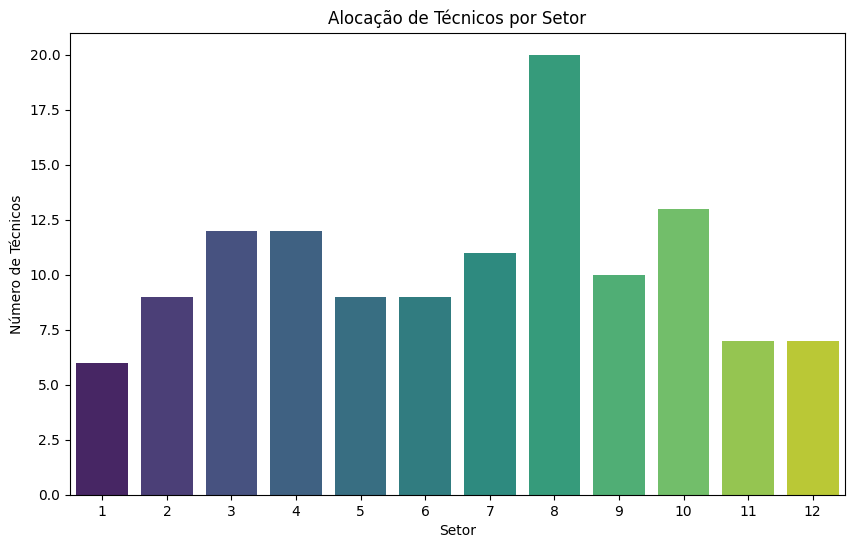
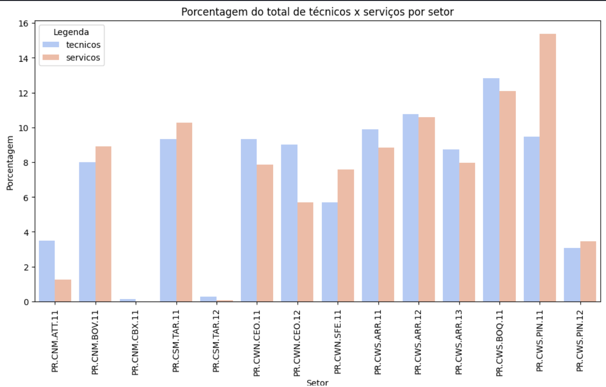
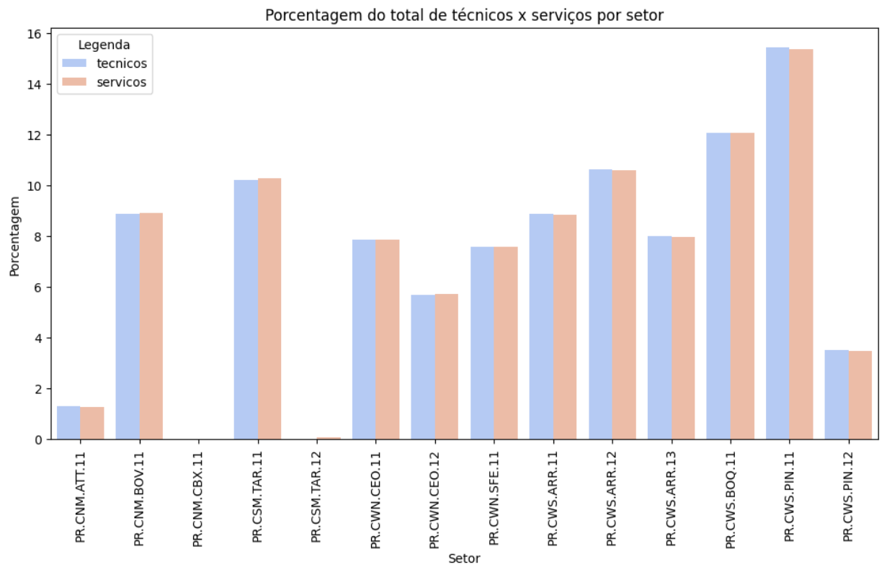

# Testes

## Sumário
- [PSO](#pso)
- [Local Search](#local-search)

## PSO

### Complexidade de Tempo
A complexidade de tempo do algoritmo PSO depende de dois fatores principais:

A complexidade de tempo do algoritmo PSO depende de dois fatores principais:

Número de Iterações (nIteracoes): A quantidade de iterações especificada afeta diretamente o tempo necessário para que o algoritmo alcance uma solução ótima ou próxima. Quanto maior o número de iterações, mais tempo será necessário para a convergência.

Tamanho da População (populacaoTamanho): O tamanho da população também influencia o tempo de execução, pois cada partícula na população passa por um processo de atualização em cada iteração. Quanto maior a população, mais cálculos são realizados em paralelo, aumentando o tempo necessário.

A complexidade de tempo do PSO é geralmente eficiente, especialmente para problemas de otimização não lineares e multi-modais, devido à natureza do algoritmo de busca baseado no comportamento coletivo das partículas.

### Complexidade de Memória

A complexidade de memória do algoritmo PSO depende principalmente dos seguintes fatores:

Tamanho da População (populacaoTamanho): A quantidade de memória alocada para manter as partículas na população é proporcional ao número de partículas. Quanto maior a população, mais memória é consumida.

Dimensão do Problema: A dimensionalidade do problema influencia diretamente a quantidade de memória usada para representar as posições, velocidades e melhores posições das partículas. Quanto maior a dimensão do problema, mais memória é necessária.

Estrutura de Dados: A estrutura de dados utilizada para armazenar as informações das partículas, como matrizes multidimensionais, também afeta a complexidade de memória.

### Execução

Existem duas opções para executar o código de PSO (Particle Swarm Optimization) uma com o console colocando os dados direto do terminal e outra usando um arquivo .txt este é um exemplo de execução do algoritmo em um teste com 2 setores cada um com um pedido e 3 técnicos:

```java
./testData/PSO_2.txt
2
1 1 
3
1 2 
2 1
1 4
```
```java
javac PSOInputTxt.java
java PSOInputTxt -file="./testData/PSO_2.txt"
```
Output:
```java
Técnico 1 alocado ao setor 2
Técnico 2 alocado ao setor 1
Técnico 3 alocado ao setor 1
[0, 1]
[1, 0]
[1, 0]
```

### Validação do funcionamento correto

#### Exemplo 1

Realizando um teste básico com dois setores e dois técnicos, onde cada técnico está designado a um setor específico. No cenário em questão, o pedido do Setor 1 está significativamente mais próximo do Técnico 1 em comparação com o Técnico 2. Da mesma forma, o pedido do Setor 2 está consideravelmente mais próximo do Técnico 2 em comparação com o Técnico 1. Este é um exemplo simplificado destinado a avaliar o desempenho do algoritmo. A solução para este caso é evidente: alocar o Técnico 1 ao Setor 1 para atender ao pedido 1 e alocar o Técnico 2 ao Setor 2 para atender ao pedido 2. Dessa maneira, o tempo de deslocamento de cada técnico é minimizado, garantindo a satisfação de todos os pedidos.



Ao conduzir os testes do algoritmo, consideramos a seguinte representação das distâncias entre os técnicos e os pedidos: a distância do Técnico 1 ao Pedido 1 é definida como 1, a distância do Técnico 1 ao Pedido 2 é 2, a distância do Técnico 2 ao Pedido 1 é 2, e a distância do Técnico 2 ao Pedido 2 é 1. Esses valores foram atribuídos para refletir com precisão o cenário previamente ilustrado.

Input
```java
cd /codigo/algoritmos/PSO
javac PSO.java
java PSO

Insira o número de setores
2
Insira a quantidade de pedidos em cada setor:
1 1
Insira o número de técnicos
2
Insira os tempos de deslocamentos
1 2 
2 1
```

Output
```java
Técnico 1 alocado ao setor 1
Técnico 2 alocado ao setor 2
[[1, 0], [0, 1]]
```
O resultado obtido é exatamente o que esperávamos: o Técnico 1 foi designado para o Setor 1, enquanto o Técnico 2 foi alocado para o Setor 2.

#### Exemplo 2 

Agora, vamos realizar um teste ligeiramente mais complexo, assemelhando-se ao caso anterior, porém, desta vez, envolvendo 3 técnicos distribuídos em 3 setores, cada um com 3 pedidos. Essa configuração pode ser representada da seguinte maneira:



Observa-se que a distância do Técnico 1 ao Pedido 3 é equivalente à distância do Técnico 2 ao Pedido 3, e esse padrão se mantém para todos os pedidos. Nesse contexto, a solução ideal seria alocar o Técnico 1 no Setor 1, o Técnico 2 no Setor 2 e o Técnico 3 no Setor 3. É fácil visualizar que essa é a solução que minimiza o tempo de deslocamento dos técnicos em relação aos pedidos, atendendo eficientemente a todas as demandas.

Input
```java
cd /codigo/algoritmos/PSO
javac PSO.java
java PSO

Insira o número de setores
3
Insira a quantidade de pedidos em cada setor:
1 1 1
Insira o número de técnicos
3
Insira os tempos de deslocamentos
1 3 3
3 1 3
3 3 1
```

Output
```java
Técnico 1 alocado ao setor 1
Técnico 2 alocado ao setor 2
Técnico 3 alocado ao setor 3
[[1, 0, 0], [0, 1, 0], [0, 0, 1]]
```
O resultado é exatamente conforme prevíamos: o Técnico 1 foi alocado no Setor 1, o Técnico 2 no Setor 2 e o Técnico 3 no Setor 3.

#### Exemplo 3 (número de técnicos > número de setores)

Agora, vamos realizar um teste que envolve a presença de 3 técnicos para atender a apenas 2 setores:



Observa-se que as distâncias dos Técnicos 1 e 2 em relação aos Pedidos 1 e 2 são equivalentes, enquanto a distância do Técnico 2 ao Pedido 1 é maior do que em relação ao Pedido 2. Nesse contexto, a alocação mais eficiente seria designar os Técnicos 1 e 2 para o Setor 1, pois apresentam menor tempo de deslocamento, e o Técnico 3 para o Setor 2. Essa abordagem minimiza ao máximo o tempo de deslocamento dos técnicos em relação aos pedidos dentro de seus setores designados, atendendo assim a todas as solicitações.

Input
```java
cd /codigo/algoritmos/PSO
javac PSO.java
java PSO

Insira o número de setores
2
Insira a quantidade de pedidos em cada setor:
1 1
Insira o número de técnicos
3
Insira os tempos de deslocamentos
1 2
1 2
2 1
```

Output
```java
Técnico 1 alocado ao setor 1
Técnico 2 alocado ao setor 2
Técnico 3 alocado ao setor 3

[[1,0], [1,0], [0,1]]
```
O desfecho é exatamente conforme antecipado: o Técnico 1 foi alocado no Setor 1, o Técnico 2 também no Setor 1, e o Técnico 3 foi designado para o Setor 3.

#### Exemplo 4 (número de técnicos < número de setores)

Agora, ao realizar um teste, nos deparamos com a situação em que há 3 setores e apenas 2 técnicos disponíveis:



As distâncias percorridas pelos Técnicos 1 para atender aos pedidos dentro do Setor 1 são consideravelmente menores do que as necessárias para o atendimento dos pedidos no Setor 3. O mesmo padrão se aplica ao Técnico 2. Nesse contexto, a alocação ideal seria designar o Técnico 1 para o Setor 1 e o Técnico 2 para o Setor 2. Embora isso possa resultar em um tempo total de deslocamento maior, a média de deslocamento por pedido será menor, permitindo que atendam a mais pedidos e atendam de maneira mais eficiente à demanda.

Input
```java
cd /codigo/algoritmos/PSO
javac PSO.java
java PSO

Insira o número de setores
3
Insira a quantidade de pedidos em cada setor:
2 3 1
Insira o número de técnicos
2
Insira os tempos de deslocamentos
1 1 3 3 3 3
3 3 1 1 1 3
```

Output
```java
Técnico 1 alocado ao setor 1
Técnico 2 alocado ao setor 2
[[1, 0, 0], [0, 1, 0]]
```

O resultado obtido é exatamente o esperado. O algoritmo não se limitou à simplicidade da distância mínima, optando por uma alocação que prioriza a realização de mais pedidos dentro de cada setor, buscando minimizar o deslocamento médio por setor.

### Correção do Algoritmo

Realizamos testes cruciais utilizando uma parcela dos dados enviados pela Vital, extraídos da pasta /codigo/dados/dadosTesteFuncionamento/. Os arquivos dfPedidos_teste1.csv e dfTecnicos_teste1.csv foram analisados, resultando nas seguintes alocações de técnicos:

Output
```java
Técnico 1 alocado ao setor 6
Técnico 2 alocado ao setor 5
Técnico 3 alocado ao setor 3
Técnico 4 alocado ao setor 1
Técnico 5 alocado ao setor 1
Técnico 6 alocado ao setor 5
Técnico 7 alocado ao setor 3
Técnico 8 alocado ao setor 5
Técnico 9 alocado ao setor 5
Técnico 10 alocado ao setor 7

{
  "finalList": [
    [0, 0, 0, 0, 1, 0, 0],
    [0, 0, 0, 0, 1, 0, 0],
    [0, 0, 0, 0, 0, 1, 0],
    [1, 0, 0, 0, 0, 0, 0],
    [0, 0, 0, 0, 0, 1, 0],
    [0, 0, 0, 0, 1, 0, 0],
    [1, 0, 0, 0, 0, 0, 0],
    [0, 0, 0, 0, 0, 1, 0],
    [0, 0, 0, 0, 1, 0, 0],
    [0, 0, 0, 1, 0, 0, 0]
  ],
  "hgindex": 0.22776996751747186
}

```
Essa resposta, proveniente do backend, indica uma otimização do tempo de deslocamento dos técnicos nos setores, buscando maximizar o número de pedidos. No entanto, observamos uma deficiência de técnicos, sugerindo a necessidade de contratações, evidenciada pelo índice de HG (Habilidade de Gestão) igual a 0. O tempo de execução para esses testes foi de aproximadamente 6 segundos.

Em um segundo teste com dados completos de um dia, extraídos da pasta /codigo/dados/dadosTesteFuncionamento/ nos arquivos dfPedidos_teste2.csv e dfTecnicos_teste2.csv, objetivamos a alocação de 125 técnicos em 368 pedidos. O tempo de execução total foi aproximadamente 5 minutos. Esse tempo pode ser ajustado no código, reduzindo o número de interações ou de população do algoritmo PSO (Particle Swarm Optimization), mas com um impacto na qualidade da solução. O índice de HG foi novamente 0.125, indicando a necessidade de contratação de mais técnicos.



## Local Search

### Complexidade de tempo

- Leitura dos Dados: A leitura dos dados de arquivos tem complexidade O(n), onde n é o número de linhas no arquivo, pois cada linha é lida uma vez.

- Cálculo da Diferença Total de Porcentagem: Esse método itera sobre todos os setores uma vez, por isso tem complexidade O(m), onde m é o número de setores.

- Cálculo do Ponto Central: O cálculo é feito para cada polígono uma vez, portanto, se houver p polígonos, a complexidade é O(p).

- Alocação Ideal de Técnicos: O loop while pode potencialmente se tornar infinito, mas tem condições de parada baseadas na diferença de porcentagem e um contador. No pior caso, a complexidade seria O(m^2), assumindo que cada técnico pode ser alocado para cada setor uma vez, e m é o número de setores.

- Alocação Inicial dos Envios de Técnicos: Aqui há um loop aninhado onde, para cada setor, ele percorre a matriz de distâncias e realiza alocações. Isso pode levar a uma complexidade de O(m^2), onde m é o número de setores.

- Cálculo da Distância: O cálculo de distância entre dois pontos é uma operação O(1), pois é apenas uma fórmula aplicada aos pontos.

- Mostrar Setores e Alocações: Estes são simplesmente loops O(m) sobre os setores para impressão de dados.

Portanto, a complexidade do algoritmo é dominada pelas funções de alocação, especialmente a alocação ideal de técnicos e a alocação inicial dos envios de técnicos, que têm complexidades O(m^2) no pior caso. Isso significa que o tempo de execução do algoritmo aumenta quadraticamente com o número de setores.

### Complexidade de Memória

Estruturas de Dados (Listas e Conjuntos):

- ArrayList<Setor> setores: Armazena uma lista de objetos Setor. Cada setor tem várias propriedades, incluindo uma lista de técnicos e serviços e um ponto central. A complexidade de memória é O(m), onde m é o número de setores únicos.
- HashSet<String> setoresUnicos: Armazena um conjunto de nomes de setores únicos. A complexidade de memória é O(u), onde u é o número de nomes de setores únicos.
- ArrayList<String> listaDeSetoresDeTecnicos e listaDeSetoresDeServicos: A memória necessária é O(n), onde n é o número total de linhas lidas dos arquivos de técnicos e serviços.
- ArrayList<double[]> listaDePoligonos: A complexidade de memória é O(p), onde p é o número de polígonos. <br><br>
Matriz de Distâncias:

- double[][] matrizDeDistancias: Uma matriz quadrada que armazena as distâncias entre todos os pares de setores. A complexidade de memória é O(m^2), onde m é o número de setores.
<br><br>
Portanto, a complexidade de memória total do algoritmo é dominada pela matriz de distâncias, que é O(m^2). Este é o maior uso de memória, pois para cada setor, é necessário armazenar a distância até todos os outros setores. As outras estruturas de dados têm complexidades lineares em termos de número de setores ou de dados lidos dos arquivos.

### Resultados

#### Maringá
Utilizando como input os arquivos relativos a Maringá (são eles: tecnicos_setor_pr_maringa.txt, servico_setembro_pr_maringa.txt e poligonos.txt)
a saída gerada é:

Setor: PR.MGA.MGA.12<br>
De onde recebe técnicos:<br>
Para onde envia técnicos:<br>
PR.MGA.MGA.11: 4 técnicos<br>


Setor: PR.MGA.MGA.11<br>
De onde recebe técnicos:<br>
PR.MGA.MGA.12: 4 técnicos<br>
Para onde envia técnicos:<br>


Distância total percorrida pelos técnicos deslocados: 24678.74 km

##### Análise
A primeira impressão é que isso só pode estar errado. É impossível que, em qualquer cidade do mundo, o deslocamento de 4 técnicos totalize quase 25 mil kilômetros. Depois de muito debugar, percebmos que o problema é que o setor PR.MGA.MGA.12 não possui suas coordenadas nos dados poligonos.txt, assim sua latitude e longitude é inicializada como zero. Dito isso, o algoritmo em si ainda se apresenta correto, dado que ele calcula corretamente a distância entre as coordenadas do setor PR.MGA.MGA.11 e as coordenadas (0.0, 0.0), dado que a distância entre a localização com latitude -23.476848, longitude -51.905161 e o ponto de coordenadas 0, 0 (equador e meridiano de Greenwich) é aproximadamente 6175.28 quilômetros.​

Sobre a questão da proporcionalidade desejada entre a porcentagem do total de técnicos e setores:<br>
Diferença inicial entre a porcentagem de técnicos e serviços presentes nos setores: 16.06%<br>
Diferença final entre a porcentagem de técnicos e serviços presentes nos setores: 1.33%<br>

#### Curitiba
Utilizando como input os arquivos relativos a Curitiba (são eles: tecnicos_setor_pr_curitiba.txt, servicos_setembro_pr_curitiba.txt e poligonos.txt)
a saída gerada é:

Setor: PR.CSM.TAR.12 <br>
De onde recebe técnicos: <br>
Para onde envia técnicos: <br>
PR.CWS.PIN.12: 2 técnicos <br>


Setor: PR.CSM.TAR.11 <br>
De onde recebe técnicos: <br>
PR.CWN.CEO.11: 6 técnicos <br>
Para onde envia técnicos: <br>


Setor: PR.CWS.PIN.11 <br>
De onde recebe técnicos: <br>
PR.CWS.BOQ.11: 5 técnicos <br>
PR.CWS.ARR.11: 7 técnicos <br>
PR.CWS.ARR.12: 1 técnicos<br>
PR.CWS.ARR.13: 5 técnicos<br>
PR.CWN.CEO.12: 18 técnicos<br>
PR.CWN.CEO.11: 4 técnicos<br>
PR.CNM.ATT.11: 1 técnicos<br>
Para onde envia técnicos:<br>


Setor: PR.CWS.PIN.12<br>
De onde recebe técnicos:<br>
PR.CSM.TAR.12: 2 técnicos<br>
PR.CNM.ATT.11: 1 técnicos<br>
Para onde envia técnicos:<br>


Setor: PR.CWS.ARR.11<br>
De onde recebe técnicos:<br>
Para onde envia técnicos:<br>
PR.CWS.PIN.11: 7 técnicos<br>


Setor: PR.CWS.ARR.12<br>
De onde recebe técnicos:<br>
Para onde envia técnicos:<br>
PR.CWS.PIN.11: 1 técnicos<br>


Setor: PR.CWN.CEO.12<br>
De onde recebe técnicos:<br>
Para onde envia técnicos:<br>
PR.CNM.BOV.11: 5 técnicos<br>
PR.CWS.PIN.11: 18 técnicos<br>


Setor: PR.CWN.CEO.11<br>
De onde recebe técnicos:<br>
Para onde envia técnicos:<br>
PR.CSM.TAR.11: 6 técnicos<br>
PR.CWS.PIN.11: 4 técnicos<br>


Setor: PR.CWS.ARR.13<br>
De onde recebe técnicos:<br>
Para onde envia técnicos:<br>
PR.CWS.PIN.11: 5 técnicos<br>


Setor: PR.CNM.ATT.11<br>
De onde recebe técnicos:<br>
Para onde envia técnicos:<br>
PR.CWS.PIN.12: 1 técnicos<br>
PR.CWN.SFE.11: 13 técnicos<br>
PR.CWS.PIN.11: 1 técnicos<br>


Setor: PR.CNM.CBX.11<br>
De onde recebe técnicos:<br>
Para onde envia técnicos:<br>
PR.CNM.BOV.11: 1 técnicos<br>


Setor: PR.CWS.BOQ.11<br>
De onde recebe técnicos:<br>
Para onde envia técnicos:<br>
PR.CWS.PIN.11: 5 técnicos<br>


Setor: PR.CWN.SFE.11<br>
De onde recebe técnicos:<br>
PR.CNM.ATT.11: 13 técnicos<br>
Para onde envia técnicos:<br>


Distância total percorrida pelos técnicos deslocados: 6653.19 km

##### Análise
Nesse caso, os dados de distância percorrida também não estão corretos, visto que os setores PR.CSM.TAR.12 e PR.CWS.PIN.12 também não possuem suas coordenadas em poligonos.txt, mas, visto que, na visão do algoritmo, os dois possuem coordenadas (0, 0), eles acabaram trocando a maior parte dos técnicos que precisavam ser realocados entre si, e portanto, interferiram menos no resultado da distância do que no caso de Maringá. Ainda assim, um dos técnicos é transferido de um desses setores para um setor que realmente está situado em Curitiba nesse cenário, assim, desconsiderando o deslocamento desse técnico, o valor seria algo próximo de 6653.19 - 6175,28 = 477,91km. Dado que há 123 técnicos deslocados, isso dá uma média de 3,89km por técnico, demonstrando que, tirando a excessão dos dados, o algoritmo faz sentido.

Sobre a questão da proporcionalidade desejada entre a porcentagem do total de técnicos e setores, antes da realocação a situação era a seguinte:

Diferença inicial entre a porcentagem de técnicos e serviços presentes nos setores: 20.18%

Ao final da alocação podemos ver uma grande melhoria:
A diferença final entre a porcentagem de técnicos e serviços presentes nos setores cai para 0.51%<br>

Segue o gráfico da proporcionalidade final:
